[← 前の章へ](document-creation-process.md) | [目次に戻る](../../README.md) | [次の章へ →](workspace-setup.md)

# 実際の文書制作への移行：段階的制作による品質確保

前章で制作情報の洗い出しと統合管理システムを構築しました。本章では、それらの情報を活用して実際の文書制作を開始する手順を説明します。特に、**一度に全体を依頼するのではなく、章・節・項ごとに段階的に制作する重要性**と、**mermaid.jsを活用した視覚的なコンテンツ作成**について詳しく解説します。

## 本章のゴール

**最終成果物**: 5編構成ハンドブックの実際の文書制作
- 章・節・項レベルでの段階的制作プロセス
- mermaid.jsによる図表・ワークフローの統合
- 品質管理と継続的改善の仕組み

**制作方針**: 段階的アプローチによる品質確保
1. **小単位制作**: 章・節・項ごとの細分化した制作依頼
2. **視覚化統合**: mermaid.jsによる図表・フローチャートの組み込み
3. **継続的検証**: 各段階での品質チェックと改善
4. **統合調整**: 段階的な統合による全体最適化

## なぜ一度に全体を依頼してはいけないのか

### 一括制作の重大な問題

#### ❌ 一度に全章を依頼した場合の課題

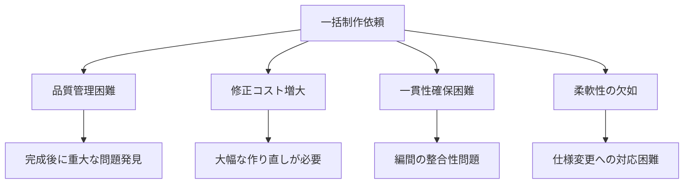

#### 具体的な失敗例

**ケース1: 文体の不統一**
```
初級者編：「AIは難しそうに思えますが、実は簡単です」
中級者編：「生成AI技術の活用により業務効率化を実現」
上級者編：「LLMベースのソリューション導入戦略」

→ 同じハンドブック内で文体レベルがバラバラ
```

**ケース2: 内容の重複・矛盾**
```
2章：「プロンプトとは指示文のことです」
5章：「プロンプト設計における重要な要素は...」
8章：「プロンプトエンジニアリングの基礎概念」

→ 同じ概念が異なるレベルで複数回説明される
```

**ケース3: 全体構成の破綻**
```
各章が個別に最適化 → 全体として学習プロセスが非効率
章間のつながりが薄い → 読者の成長が段階的でない
```

### ✅ 段階的制作の利点

#### 品質管理の向上

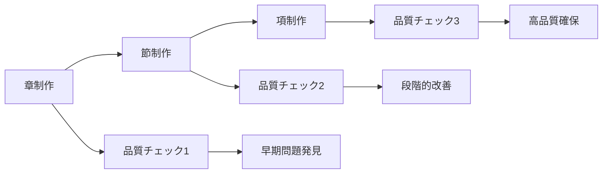

#### 効率的な修正プロセス

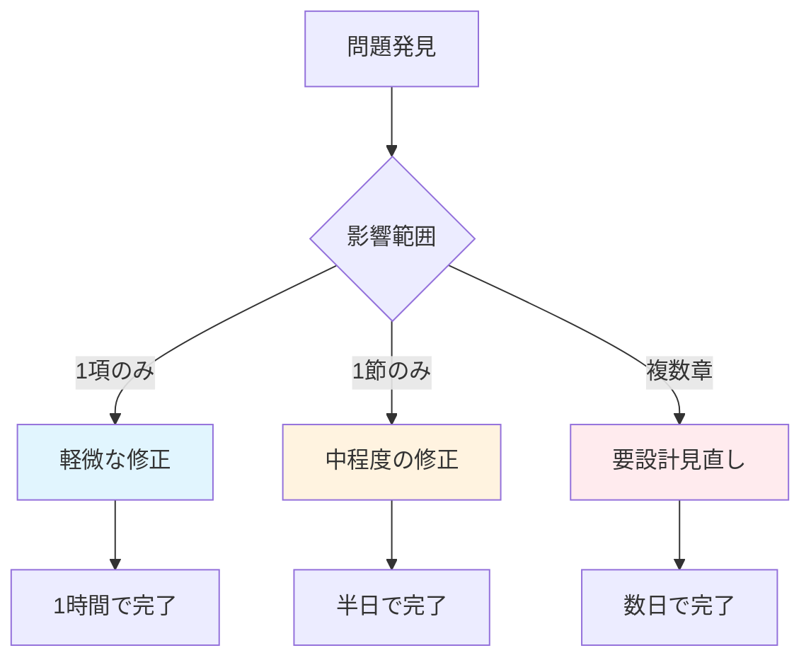

### 制作単位の最適化

#### 推奨制作単位

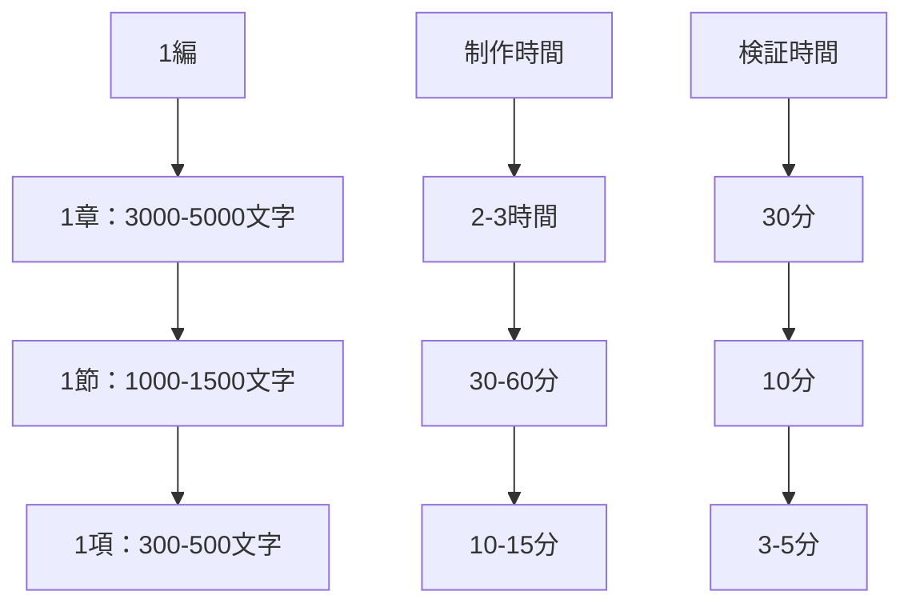

#### 最適な依頼タイミング

```mermaid
gantt
    title 段階的制作スケジュール
    dateFormat  X
    axisFormat %s
    
    section 1章制作
    章構成設計    :done, ch1-plan, 0, 1
    1.1節制作    :done, ch1-s1, 1, 2
    1.2節制作    :active, ch1-s2, 2, 3
    1.3節制作    :ch1-s3, 3, 4
    章統合調整    :ch1-int, 4, 5
    
    section 品質管理
    1.1節検証    :done, qc1-s1, 1, 2
    1.2節検証    :active, qc1-s2, 2, 3
    1.3節検証    :qc1-s3, 3, 4
    章全体検証    :qc1-ch, 4, 5
```

## mermaid.jsを活用した視覚的コンテンツ制作

### なぜmermaid.jsが最適なのか

#### 従来の図表作成の課題

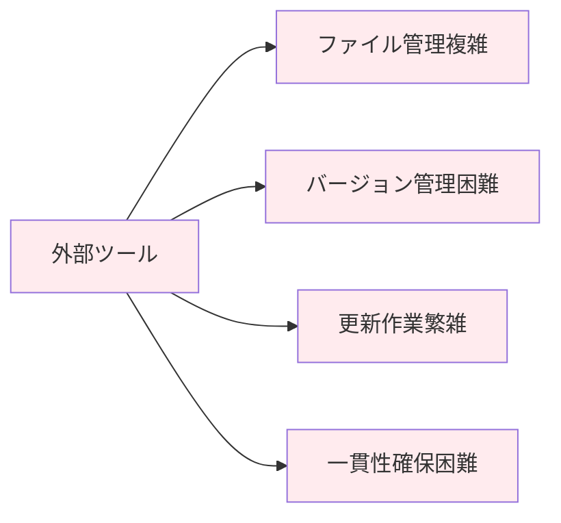

#### mermaid.jsの利点

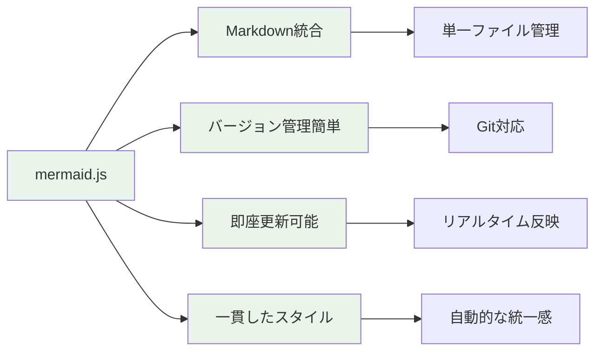

### 編別のmermaid.js活用戦略

#### 初級者編での活用

**特徴**: シンプルで分かりやすい図解
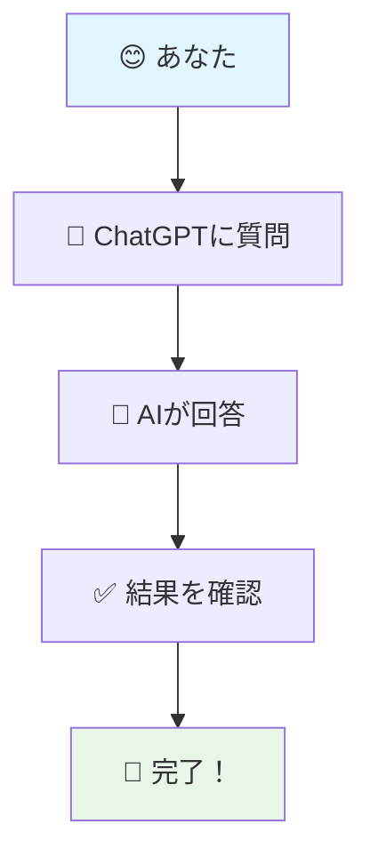

#### 中級者編での活用

**特徴**: 実務フローの可視化
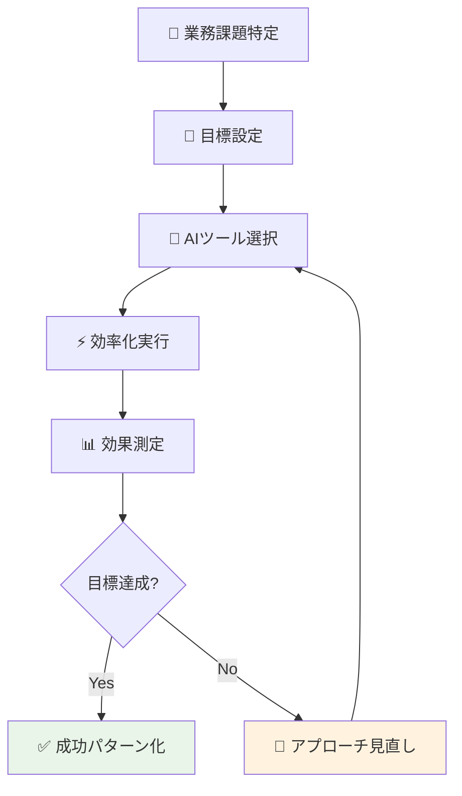

#### 上級者編での活用

**特徴**: 戦略的・システム的な表現
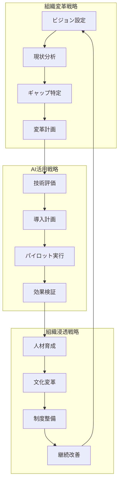

## 段階的制作の実行プロセス

### Phase 1: 章レベル制作

#### 章構成設計プロンプト

```bash
# Claude code設定
/set output_dir content/chapter_creation
/set session_name "chapter_structure_design"
```

#### 🎯 簡潔プロンプト（推奨）
```
初級者編第1章「はじめての生成AI体験」の構成を設計してください。mermaid.jsで学習フローも作成してください
```

#### 📝 詳細プロンプト（必要に応じて）
```
5編構成ハンドブックの初級者編第1章「はじめての生成AI体験」の詳細構成を設計してください。

【章の基本情報】
- 対象読者：生成AI完全未経験者
- 学習目標：3分で安全な成功体験を獲得
- 所要時間：15-20分
- 重点：安心感と成功体験の提供

【必要な構成要素】
1. **章の導入**（この章で学べること）
2. **節の構成**（3-4節に分割）
3. **実践課題**（段階的な難易度設定）
4. **振り返り**（達成感の演出）

【mermaid.js要求】
- 学習プロセスのフローチャート
- 読者の心理変化の可視化
- 成功パターンの図解

【出力形式】
- 章全体の構成案
- 各節の概要（200文字程度）
- mermaid.jsコード（3つ以上）
- 次節制作への引き継ぎ情報
```

### Phase 2: 節レベル制作

#### 節内容制作プロンプト

```bash
# Claude code設定
/set session_name "section_content_creation"
```

#### 🎯 簡潔プロンプト（推奨）
```
第1章第1節「生成AIって何？」の内容を作成してください。図解もmermaid.jsで作成してください
```

#### 📝 詳細プロンプト（必要に応じて）
```
初級者編第1章第1節「生成AIって何？」の実際の内容を作成してください。

【前提情報】
- 章構成：前回設計済みの構成に基づく
- 対象読者：生成AI完全未経験者
- 節の目標：基本概念を3分で理解
- 文体：親しみやすく、安心感重視

【内容要求】
1. **導入**（不安解消の配慮）
2. **本文**（800-1000文字）
3. **具体例**（日常的で身近な例）
4. **ミニ課題**（3分で完了する簡単な体験）

【mermaid.js要求】
- 生成AIの基本概念図
- 身近な例での活用イメージ
- 安全な体験フローの図解

【品質基準】
- 専門用語は必ず日本語併記
- 「大丈夫です」「心配ありません」などの安心表現を含む
- 失敗リスクの少ない内容設計
- 次節への自然な流れ

【出力形式】
- 完成した節の内容（Markdown形式）
- mermaid.jsコード（2つ以上）
- 読者の理解度確認用チェックリスト
```

### Phase 3: 項レベル制作

#### 項詳細制作プロンプト

```bash
# Claude code設定
/set session_name "subsection_detail_creation"
```

#### 🎯 簡潔プロンプト（推奨）
```
「生成AIの身近な例」の項を詳しく作成してください。実例とmermaid.jsの図解も含めてください
```

#### 📝 詳細プロンプト（必要に応じて）
```
第1節内の「生成AIの身近な例」の項を詳細に作成してください。

【項の役割】
- 抽象的な概念を具体例で理解促進
- 読者の「自分にも関係ある」という実感獲得
- 次の実践課題への心理的準備

【具体例の要件】
- 大学業務に関連した身近な例
- 教員・職員両方に通じる内容
- 成功イメージが描きやすい例

【mermaid.js活用】
- 具体例の活用フロー
- Before/After比較図
- 読者の体験ステップ

【文章要求】
- 300-400文字
- 具体的で想像しやすい描写
- ポジティブで励ましの表現
- 専門用語なし

【出力形式】
- 完成した項の内容
- mermaid.jsコード（1-2個）
- 読者の理解確認ポイント
- 次項への連結要素
```

## 品質管理と継続的改善

### 各段階での品質チェック

#### 章レベルでの確認項目

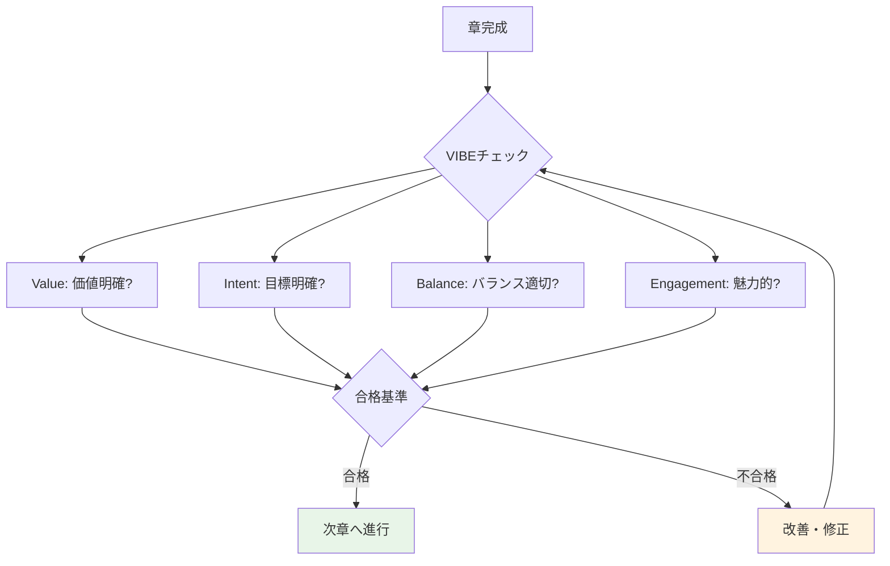

#### 編間整合性チェック

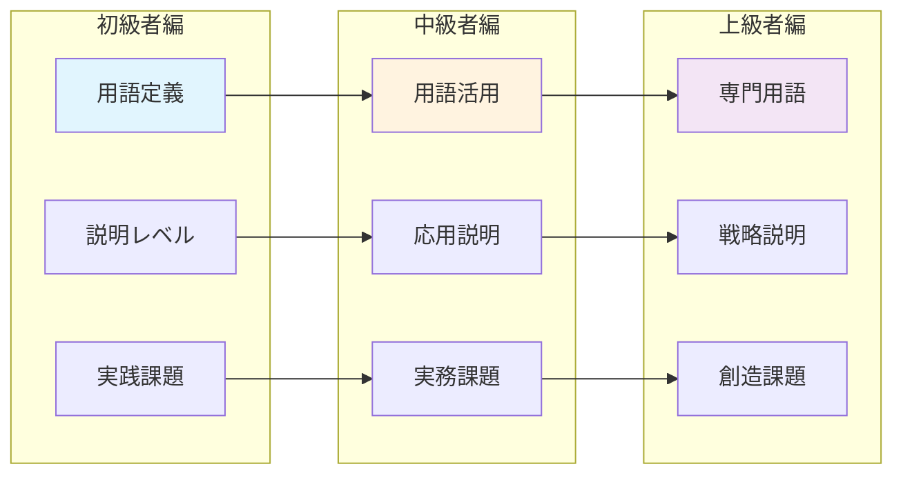

### 継続的改善プロセス

#### 改善サイクル

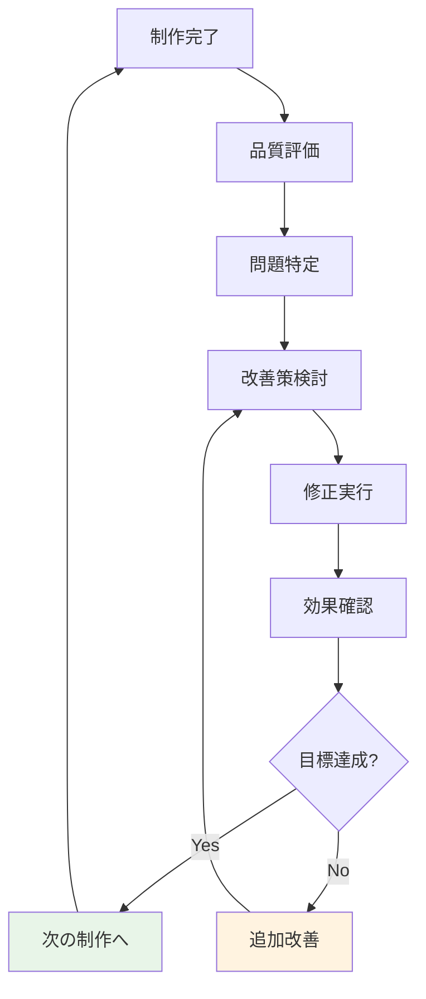

#### フィードバック活用


## 制作効率化のテクニック

### テンプレート活用

#### 節制作テンプレート

```markdown
# [節タイトル]

## この節で学ぶこと
- [学習目標1]
- [学習目標2]
- [学習目標3]

## 導入
[読者の関心を引く導入文 - 100文字程度]

## 本文
[メインコンテンツ - 800-1000文字]

### [小見出し1]
[内容詳細]

```mermaid
[関連する図解・フローチャート]
```

### [小見出し2]
[内容詳細]

## 実践してみよう
[簡単な課題 - 3-5分で完了]

## 振り返り
- [ ] [チェック項目1]
- [ ] [チェック項目2]
- [ ] [チェック項目3]

## 次のステップ
[次節への自然な導線]
```

### バッチ処理の活用

#### 類似項目の一括制作

```bash
# 複数節の事例部分を一括制作
/set session_name "examples_batch_creation"
```

#### 🎯 簡潔プロンプト
```
第1-3章の「具体例」部分をまとめて作成してください。mermaid.jsの図解も含めて
```

#### mermaid.js一括生成

```bash
# 図解の一括生成
/set session_name "diagrams_batch_creation"
```

#### 🎯 簡潔プロンプト
```
初級者編全体で使用するフローチャートを統一デザインで作成してください
```

## まとめ

### 段階的制作の成功要因

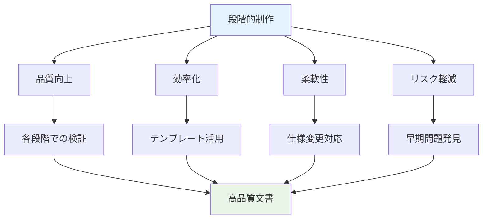

### mermaid.js活用の効果

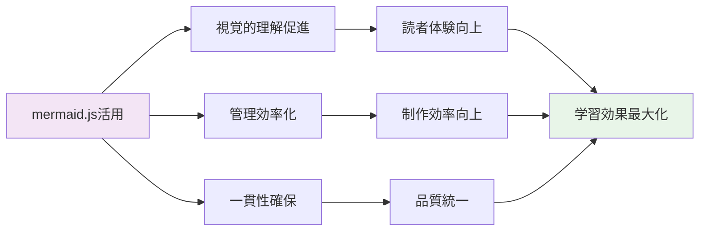

段階的制作とmermaid.js活用により、効率的かつ高品質な文書制作が実現できます。次は実際にこのプロセスを適用して、5編構成ハンドブックの制作を開始しましょう。

---

[← 前の章へ](document-creation-process.md) | [目次に戻る](../../README.md) | [次の章へ →](workspace-setup.md)

---