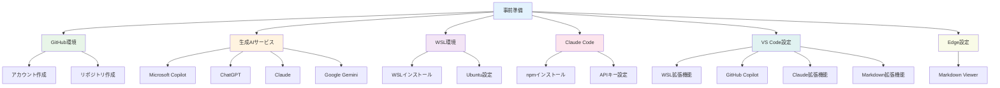
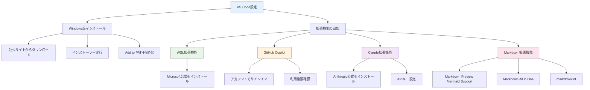
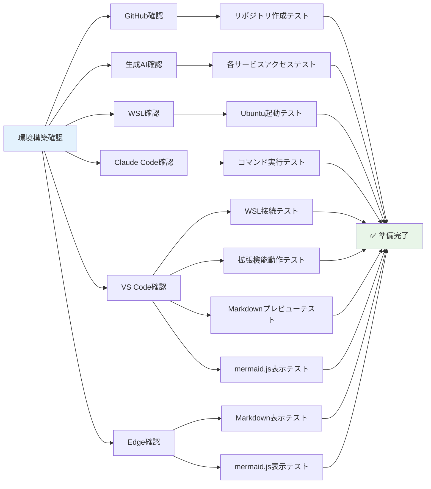
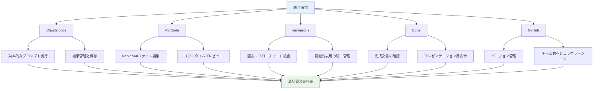

---

[← 前の章へ](what-is-vibe-writing.md) | [目次に戻る](../../README.md) | [次の章へ →](vibe-strategy-design.md)

---

# 事前準備

本書でVibe Writingを実践するために必要な環境構築について説明します。

## 必要なツールとサービス



### 1. GitHubアカウントとリポジトリ

#### GitHubアカウントの作成
1. [GitHub](https://github.com)にアクセス
2. 「Sign up」からアカウントを作成
3. メールアドレスの認証を完了

#### リポジトリの作成
1. GitHubにログイン後、「New repository」をクリック
2. リポジトリ名を入力（例：`ai-handbook-for-faculty`）
3. 公開設定を選択（Public/Private）
4. READMEファイルを追加するオプションにチェック
5. 「Create repository」をクリック

### 2. 生成AIサービスの準備

以下のいずれか、または複数のサービスを利用できるようにしてください：

#### Microsoft Copilot
- Microsoftアカウントでログイン
- [Copilot](https://copilot.microsoft.com)にアクセス

#### ChatGPT
- OpenAIアカウントを作成
- [ChatGPT](https://chat.openai.com)にアクセス

#### Claude (Anthropic)
- Anthropicアカウントを作成
- [Claude](https://claude.ai)にアクセス

#### Google Gemini
- Googleアカウントでログイン
- [Gemini](https://gemini.google.com)にアクセス

### 3. WSL（Windows Subsystem for Linux）のインストール

Windows PCでLinux環境を利用するためにWSLをインストールします。

#### インストール手順
1. PowerShellを管理者として実行
2. 以下のコマンドを実行：
   ```powershell
   wsl --install
   ```
3. PCを再起動
4. Ubuntuの初期設定（ユーザー名とパスワードの設定）

#### 確認方法
```bash
wsl --version
```

### 4. Claude Codeのセットアップ

#### 前提条件
- WSLがインストール済み
- Anthropic APIキーの取得

#### インストール手順
1. WSLターミナルを開く
2. 以下のコマンドでClaude Codeをインストール：
   ```bash
   npm install -g @anthropic-ai/claude-code
   ```
3. APIキーの設定：
   ```bash
   export ANTHROPIC_API_KEY="your-api-key"
   ```

### 5. Visual Studio Codeの設定



#### Windows版のインストール
1. [VS Code公式サイト](https://code.visualstudio.com)からダウンロード
2. インストーラーを実行
3. 「Add to PATH」オプションを有効化

#### WSL拡張機能の追加
1. VS Codeを起動
2. 拡張機能（Extensions）を開く
3. 「WSL」で検索し、Microsoft公式のWSL拡張機能をインストール

#### GitHub Copilotの設定
1. VS Codeの拡張機能から「GitHub Copilot」を検索
2. インストール後、GitHubアカウントでサインイン
3. Copilotの利用権限を確認（有料サービス）

#### Claude for VS Codeの設定
1. 拡張機能から「Claude」を検索
2. Anthropic公式の拡張機能をインストール
3. APIキーを設定

#### Markdown・mermaid.js表示用拡張機能
1. **Markdown Preview Mermaid Support**をインストール
   - 拡張機能から「Markdown Preview Mermaid Support」を検索
   - インストール後、Markdownファイルのプレビューでmermaid.jsが表示される
   - Ctrl+Shift+V（またはCmd+Shift+V）でプレビュー表示

2. **その他推奨Markdown拡張機能**
   - 「Markdown All in One」：Markdown編集支援
   - 「markdownlint」：Markdownの品質チェック

### 6. Microsoft Edgeの設定

#### Markdown Viewer拡張機能
1. **Markdown Viewer**拡張機能をインストール
   - Microsoft Edge Add-onsストアから「Markdown Viewer」を検索
   - インストール後、.mdファイルをブラウザで直接表示可能
   - mermaid.jsの図表も正しく表示される

2. **設定方法**
   - 拡張機能インストール後、設定で「ファイルURLへのアクセスを許可する」を有効化
   - これにより、ローカルの.mdファイルをEdgeで直接開いて表示可能

3. **使用方法**
   - .mdファイルをEdgeにドラッグ&ドロップ
   - または、ファイルを右クリック→「プログラムから開く」→「Microsoft Edge」

## 環境構築の確認



### チェックリスト
- [ ] GitHubにリポジトリが作成できている
- [ ] 生成AIサービスにアクセスできる
- [ ] WSLでUbuntuが起動できる
- [ ] Claude Codeコマンドが実行できる
- [ ] VS CodeでWSL環境のファイルが編集できる
- [ ] GitHub CopilotやClaude拡張機能が動作する
- [ ] VS CodeでMarkdownプレビューが表示できる（Ctrl+Shift+V）
- [ ] VS Codeでmermaid.js図表が正しく表示される
- [ ] EdgeでMarkdownファイルが直接表示できる
- [ ] Edgeでmermaid.js図表が正しく表示される

## トラブルシューティング

### WSLが起動しない場合
1. Windows Updateを最新にする
2. BIOSで仮想化機能を有効化
3. Windows機能で「仮想マシンプラットフォーム」を有効化

### VS CodeでWSLに接続できない場合
1. WSL拡張機能が正しくインストールされているか確認
2. WSLターミナルから`code .`コマンドで起動してみる

### Markdownプレビューが表示されない場合
1. **VS Codeの場合**
   - 「Markdown Preview Mermaid Support」拡張機能が正しくインストールされているか確認
   - Ctrl+Shift+V（またはCmd+Shift+V）でプレビューを開く
   - 拡張機能を一度無効化→有効化して再起動

2. **mermaid.js図表が表示されない場合**
   - 「Markdown Preview Mermaid Support」拡張機能が有効になっているか確認
   - mermaidコードブロックの記述が正しいか確認（\`\`\`mermaid で開始）
   - VS Codeを再起動

### EdgeでMarkdownが表示されない場合
1. **Markdown Viewer拡張機能の確認**
   - Microsoft Edge Add-onsから正しくインストールされているか確認
   - 拡張機能の設定で「ファイルURLへのアクセスを許可する」が有効になっているか確認

2. **ファイルアクセスの問題**
   - .mdファイルをEdgeに直接ドラッグ&ドロップしてみる
   - ファイルパスに日本語や特殊文字が含まれていないか確認

## まとめ

これらの準備が整えば、Vibe Writingを活用して大学教職員向けの生成AI利活用ハンドブックを作成する準備が完了です。

### 構築された環境の活用



- **Claude code**: 効率的なプロンプト実行と結果管理
- **VS Code**: Markdownファイルの編集とリアルタイムプレビュー
- **mermaid.js**: 図表・フローチャートの統合的な管理
- **Edge**: 完成した文書の確認とプレゼンテーション
- **GitHub**: バージョン管理とチーム共有

これらのツールを組み合わせることで、視覚的で分かりやすく、かつ効率的な文書作成が可能になります。特に、mermaid.jsによる図表統合により、読者の理解を大幅に促進する文書を作成できます。

---

[← 前の章へ](what-is-vibe-writing.md) | [目次に戻る](../../README.md) | [次の章へ →](vibe-strategy-design.md)

---