[← 前の章へ](content-creation-execution.md) | [目次に戻る](../../README.md)

# Vibe Writingハンドブックを活用したプレゼンテーション資料作成ガイド

Vibe Writingで作成したハンドブックを基に、効果的なプレゼンテーション資料を作成する手法について詳しく説明します。本ガイドでは、ハンドブックの構造化されたコンテンツを活用し、Claude codeと各種プレゼンテーションフレームワークを組み合わせて、高品質なプレゼン資料を効率的に制作する方法を解説します。

## 本章のゴール

**最終成果物**: Vibe Writingベースの高品質プレゼンテーション資料
- ハンドブックとの一貫性を保った統合的なコンテンツ
- 聴衆レベルに応じたカスタマイズされたプレゼン
- インタラクティブで視覚的に魅力的な資料

**制作プロセス**: 段階的アプローチによる効率的制作
1. **コンテンツ変換**: ハンドブックからプレゼン構造への再構成
2. **フレームワーク選択**: 目的に応じた最適ツールの選定
3. **視覚化強化**: mermaid.js等による図解の充実
4. **インタラクション設計**: 聴衆参加型要素の組み込み

## Vibe Writingベースのプレゼンテーション作成メリット

### 📊 コンテンツの一貫性とブランド統一

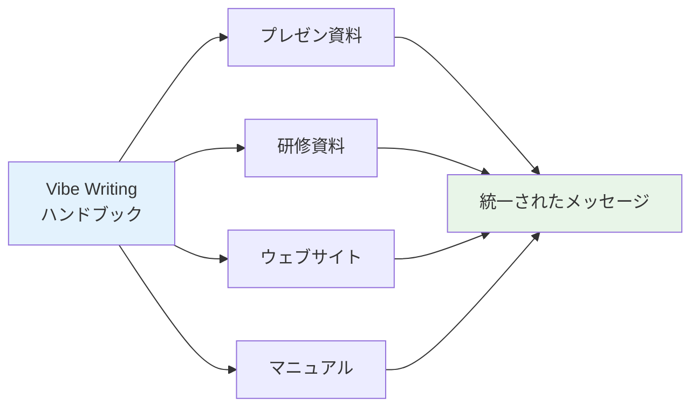
```mermaid
graph LR
    A[Vibe Writing<br/>ハンドブック] --> B[プレゼン資料]
    A --> C[研修資料]
    A --> D[ウェブサイト]
    A --> E[マニュアル]
    
    B --> F[統一されたメッセージ]
    C --> F
    D --> F
    E --> F
    
    style A fill:#e3f2fd
    style F fill:#e8f5e8
```

#### 🎯 統一されたメッセージング
- **VIBEの4要素の一貫性**: 価値、意図、バランス、エンゲージメントがプレゼンでも自動的に維持
- **読者視点の継承**: ハンドブックで明確化された読者ニーズがプレゼン設計に直接反映
- **段階的情報展開**: 5編構成の学習プロセスをプレゼンの流れに自然に活用

#### 🔄 双方向の品質向上サイクル
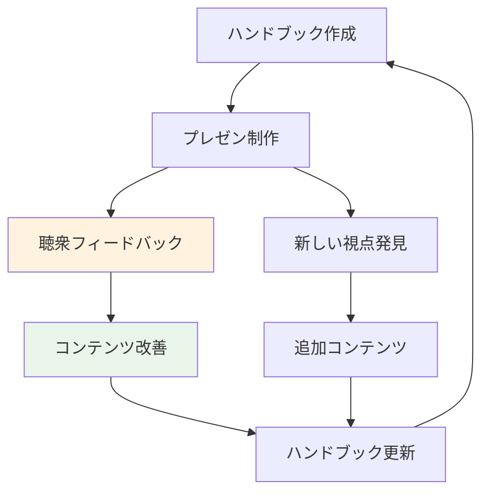
```mermaid
flowchart TD
    A[ハンドブック作成] --> B[プレゼン制作]
    B --> C[聴衆フィードバック]
    C --> D[コンテンツ改善]
    D --> E[ハンドブック更新]
    E --> A
    
    B --> F[新しい視点発見]
    F --> G[追加コンテンツ]
    G --> E
    
    style C fill:#fff3e0
    style D fill:#e8f5e8
```

### ⚡ 効率的な制作プロセス

#### 既存アセットの最大活用
- **構造化コンテンツの再利用**: ハンドブックの章構成をスライド構成に直接変換
- **mermaid.js図解の流用**: ハンドブックの図表をプレゼンでそのまま活用
- **一貫したブランディング**: 文書とプレゼンで統一された表現とデザイン

#### Claude codeによる自動化メリット
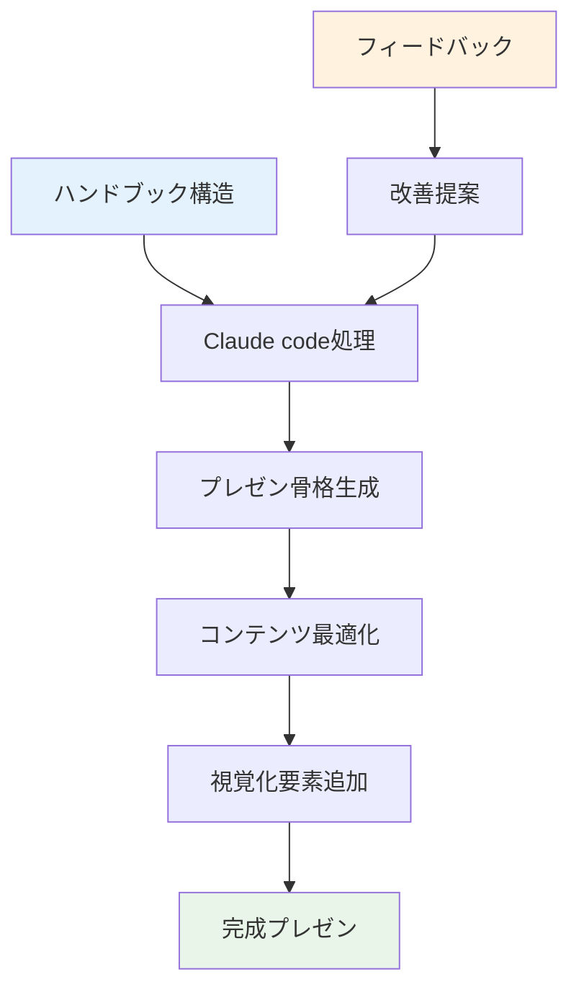
```mermaid
graph TD
    A[ハンドブック構造] --> B[Claude code処理]
    B --> C[プレゼン骨格生成]
    C --> D[コンテンツ最適化]
    D --> E[視覚化要素追加]
    E --> F[完成プレゼン]
    
    G[フィードバック] --> H[改善提案]
    H --> B
    
    style A fill:#e3f2fd
    style F fill:#e8f5e8
    style G fill:#fff3e0
```

### 🎯 聴衆適応性の向上

#### レベル別カスタマイズ
- **初級者向け**: 安心感と成功体験を重視したプレゼン構成
- **中級者向け**: 実用性と効率化を前面に出した実演中心の内容
- **上級者向け**: 戦略性と創造性を強調したビジョナリーなアプローチ

#### 多目的での活用可能性
- **導入プレゼン**: 管理職向けの意思決定支援資料
- **研修資料**: 段階別スキルアップ用のトレーニング教材
- **成果報告**: 導入効果と改善事例の可視化

## プレゼンテーションフレームワーク比較分析

### 📊 mermaid.js：視覚化の中核

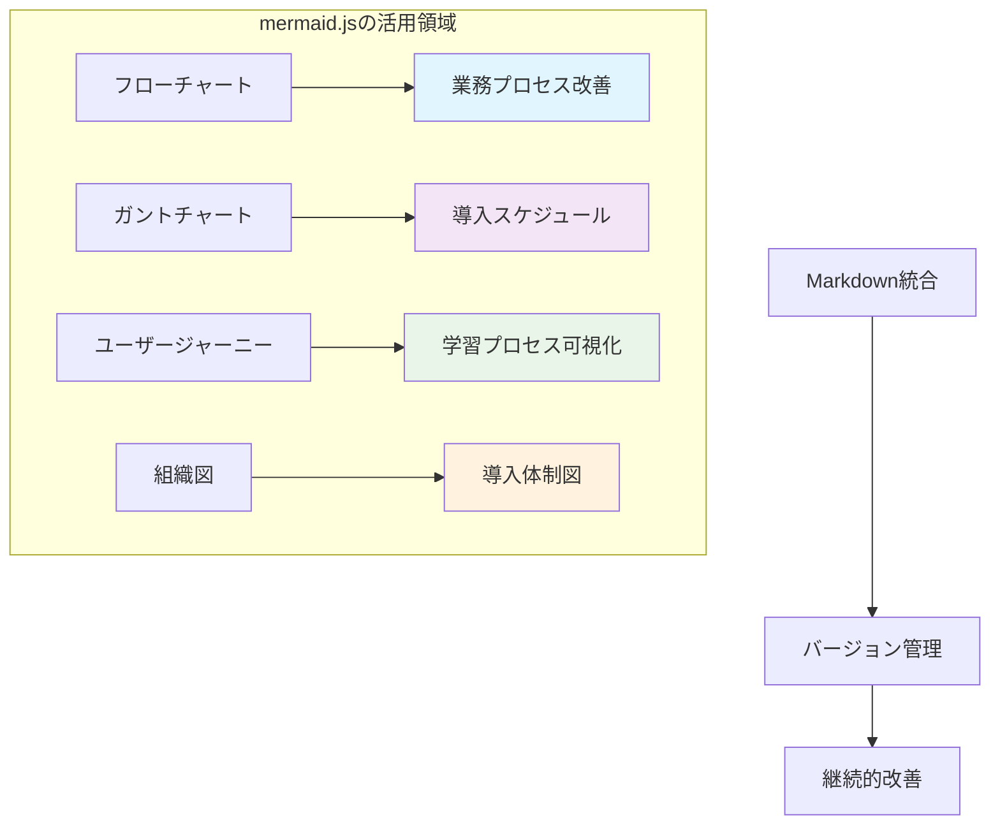
```mermaid
graph TB
    subgraph "mermaid.jsの活用領域"
        A[フローチャート] --> A1[業務プロセス改善]
        B[ガントチャート] --> B1[導入スケジュール]
        C[ユーザージャーニー] --> C1[学習プロセス可視化]
        D[組織図] --> D1[導入体制図]
    end
    
    E[Markdown統合] --> F[バージョン管理]
    F --> G[継続的改善]
    
    style A1 fill:#e1f5fe
    style B1 fill:#f3e5f5
    style C1 fill:#e8f5e8
    style D1 fill:#fff3e0
```

#### 主要メリット
- **Markdown完全統合**: ハンドブックの図表をコピー&ペーストで即活用
- **Gitバージョン管理**: 図表の変更履歴を完全追跡
- **リアルタイム更新**: コード変更で即座に図表更新

#### 活用シーン別設計パターン

**初級者向けプレゼン**
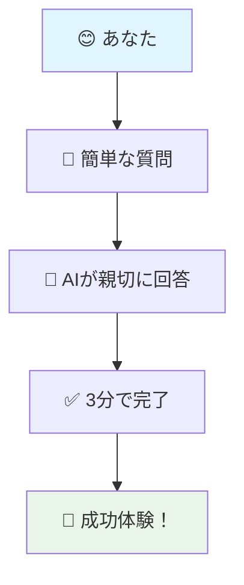
```mermaid
graph TD
    A[😊 あなた] --> B[💬 簡単な質問]
    B --> C[🤖 AIが親切に回答]
    C --> D[✅ 3分で完了]
    D --> E[🎉 成功体験！]
    
    style A fill:#e1f5fe
    style E fill:#e8f5e8
```

**上級者向けプレゼン**
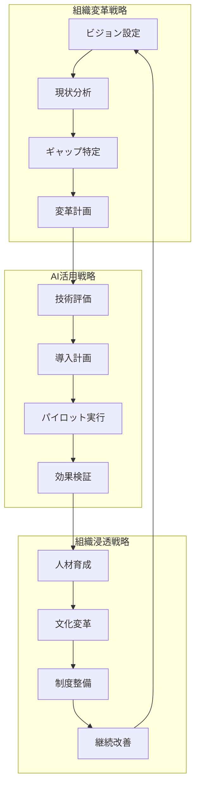
```mermaid
graph TB
    subgraph "組織変革戦略"
        A[ビジョン設定] --> B[現状分析]
        B --> C[ギャップ特定]
        C --> D[変革計画]
    end
    
    subgraph "AI活用戦略"
        E[技術評価] --> F[導入計画]
        F --> G[パイロット実行]
        G --> H[効果検証]
    end
    
    subgraph "組織浸透戦略"
        I[人材育成] --> J[文化変革]
        J --> K[制度整備]
        K --> L[継続改善]
    end
    
    D --> E
    H --> I
    L --> A
```

### 🎭 Reveal.js：高度なインタラクションの実現

#### 核心的メリット
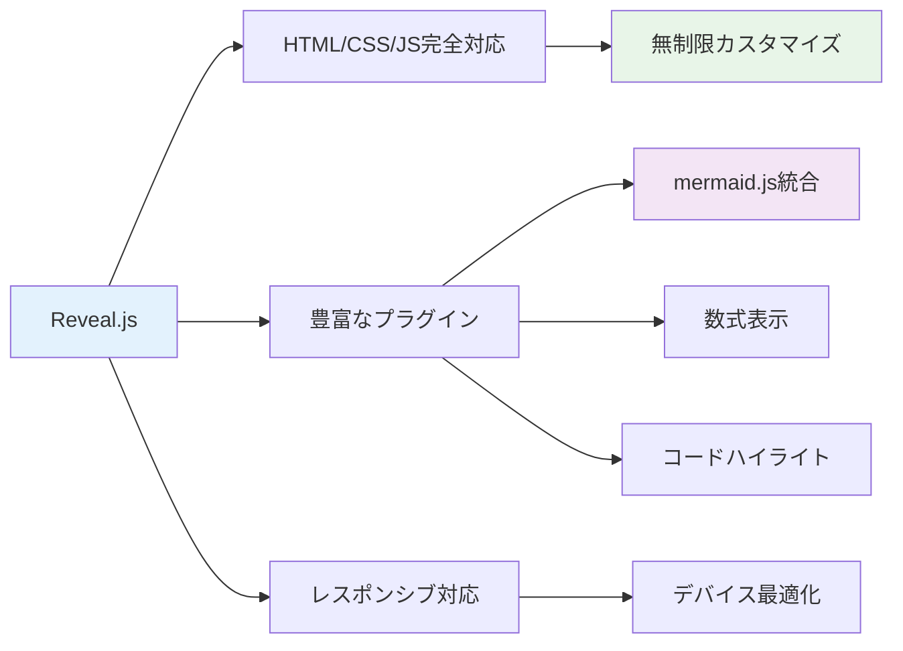
```mermaid
flowchart LR
    A[Reveal.js] --> B[HTML/CSS/JS完全対応]
    B --> C[無制限カスタマイズ]
    
    A --> D[豊富なプラグイン]
    D --> E[mermaid.js統合]
    D --> F[数式表示]
    D --> G[コードハイライト]
    
    A --> H[レスポンシブ対応]
    H --> I[デバイス最適化]
    
    style A fill:#e3f2fd
    style C fill:#e8f5e8
    style E fill:#f3e5f5
```

#### 実装可能な高度機能
- **動的mermaid.js**: ホバーエフェクトとクリック連動
- **ライブデモ統合**: Claude codeの実際の操作画面埋め込み
- **聴衆参加システム**: リアルタイム投票とQ&A
- **進捗可視化**: 学習ロードマップの動的表示

### 📝 Remark.js：Markdownネイティブの効率性

#### 特化メリット
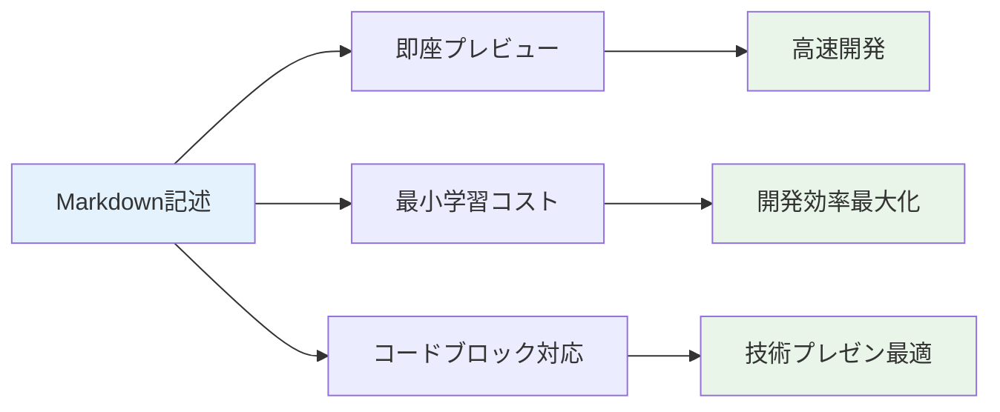
```mermaid
graph LR
    A[Markdown記述] --> B[即座プレビュー]
    B --> C[高速開発]
    
    A --> D[最小学習コスト]
    D --> E[開発効率最大化]
    
    A --> F[コードブロック対応]
    F --> G[技術プレゼン最適]
    
    style A fill:#e3f2fd
    style C fill:#e8f5e8
    style E fill:#e8f5e8
    style G fill:#e8f5e8
```

#### プログラマー・技術者向け最適化
- **シンタックスハイライト**: Claude code実例の美しい表示
- **キーボードナビゲーション**: 効率的なプレゼン操作
- **軽量高速**: ストレスフリーな動作

### 🔄 Swiper.js：モバイルファーストの体験

#### モバイル特化メリット
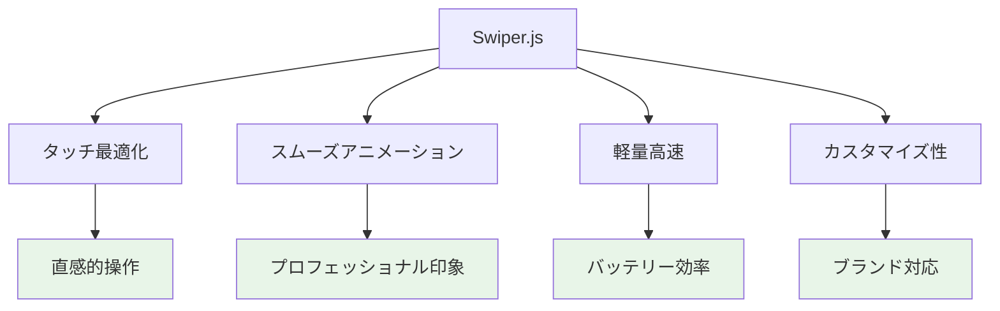
```mermaid
flowchart TD
    A[Swiper.js] --> B[タッチ最適化]
    B --> C[直感的操作]
    
    A --> D[スムーズアニメーション]
    D --> E[プロフェッショナル印象]
    
    A --> F[軽量高速]
    F --> G[バッテリー効率]
    
    A --> H[カスタマイズ性]
    H --> I[ブランド対応]
    
    style C fill:#e8f5e8
    style E fill:#e8f5e8
    style G fill:#e8f5e8
    style I fill:#e8f5e8
```

#### モバイル活用シナリオ
- **移動中の閲覧**: 通勤時間での学習促進
- **タブレット研修**: ハンズオン形式の実習
- **オフライン対応**: ネットワーク環境を選ばない活用

### 🎨 Marp：VS Code統合の生産性

#### 開発効率メリット
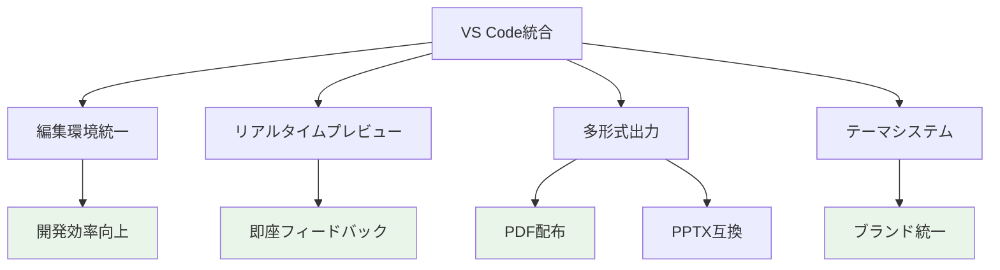
```mermaid
graph TB
    A[VS Code統合] --> B[編集環境統一]
    B --> C[開発効率向上]
    
    A --> D[リアルタイムプレビュー]
    D --> E[即座フィードバック]
    
    A --> F[多形式出力]
    F --> G[PDF配布]
    F --> H[PPTX互換]
    
    A --> I[テーマシステム]
    I --> J[ブランド統一]
    
    style C fill:#e8f5e8
    style E fill:#e8f5e8
    style G fill:#e8f5e8
    style J fill:#e8f5e8
```

#### Claude codeとの完全統合
- **同一環境での編集**: ハンドブックとプレゼンを同じエディタで管理
- **CSS完全制御**: 大学ブランドに合わせた詳細カスタマイズ
- **バッチ処理対応**: 複数プレゼンの一括生成

## 追加推奨フレームワーク

### 📱 Spectacle (React-based)：コンポーネント指向

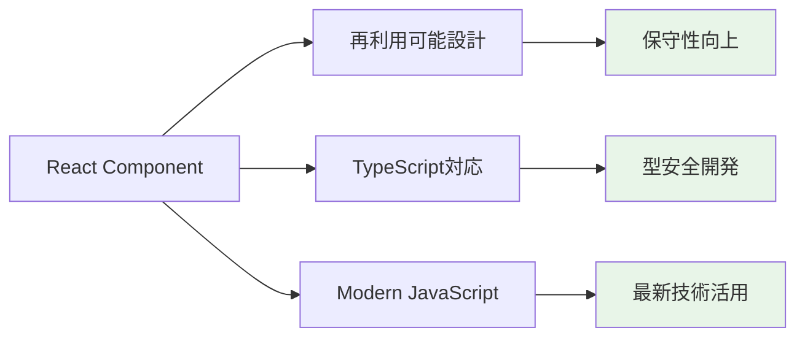
```mermaid
graph LR
    A[React Component] --> B[再利用可能設計]
    B --> C[保守性向上]
    
    A --> D[TypeScript対応]
    D --> E[型安全開発]
    
    A --> F[Modern JavaScript]
    F --> G[最新技術活用]
    
    style C fill:#e8f5e8
    style E fill:#e8f5e8
    style G fill:#e8f5e8
```

#### 適用シーン
- **大規模プレゼンシステム**: 複数部門での標準化
- **動的コンテンツ**: データベース連携での実時間更新
- **テンプレート化**: 5編それぞれの標準テンプレート作成

### 🎯 Deck.js：豊富なエフェクト

#### 視覚的インパクト重視
- **印象的なトランジション**: 聴衆の注意を引く演出
- **テーマバリエーション**: 多様な場面での使い分け
- **jQuery拡張性**: 既存システムとの統合容易性

### ⚡ Bespoke.js：軽量モジュラー設計

#### カスタマイズ重視
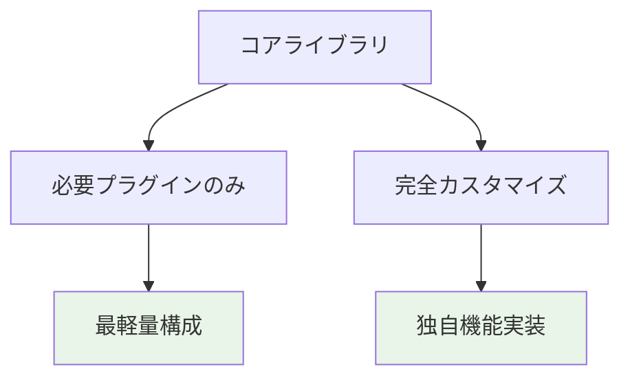
```mermaid
graph TD
    A[コアライブラリ] --> B[必要プラグインのみ]
    B --> C[最軽量構成]
    
    A --> D[完全カスタマイズ]
    D --> E[独自機能実装]
    
    style C fill:#e8f5e8
    style E fill:#e8f5e8
```

### 🎪 Impress.js：3D効果による印象強化

#### 高インパクトプレゼン
- **3D遷移効果**: 記憶に残る視覚体験
- **ズーム・回転**: 概念の立体的表現
- **創造的表現**: 従来にない発表スタイル

### 📊 Observable Framework：データ駆動プレゼン

#### リアルタイムデータ活用
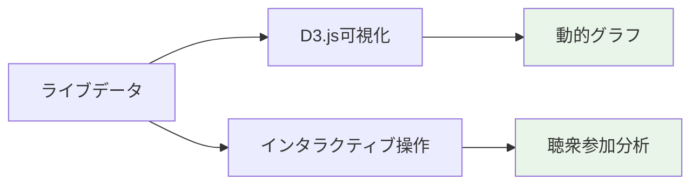
```mermaid
flowchart LR
    A[ライブデータ] --> B[D3.js可視化]
    B --> C[動的グラフ]
    
    A --> D[インタラクティブ操作]
    D --> E[聴衆参加分析]
    
    style C fill:#e8f5e8
    style E fill:#e8f5e8
```

## Claude codeを活用したプレゼンテーション制作プロセス

### 🎯 Phase 1: コンテンツ構造分析と変換

#### ハンドブック構造のプレゼン最適化

```bash
# Claude code設定
/set output_dir presentations/content_analysis
/set session_name "handbook_to_presentation_conversion"
```

#### 基本変換プロンプト

**🎯 簡潔プロンプト（推奨）**
```
Vibe Writingハンドブック第3章をプレゼンスライドに変換してください
```

**📝 詳細プロンプト**
```
Vibe Writingで作成した大学教職員向け生成AI利活用ハンドブックを基に、プレゼンテーション資料を作成してください。

【変換対象】
- 対象：中級者編（教員用）第3章「授業準備の効率化」
- 原文字数：約3,000文字（mermaid.js図解3つ含む）
- 構成：導入→本文（3節）→実践課題→まとめ

【プレゼン要件】
- 対象聴衆：教員（基本操作習得済み）
- 発表時間：15分
- 環境：プロジェクター投影、配布資料なし
- 目的：実践への動機付けと具体的手順の理解

【変換ルール】
1. **1スライド1メッセージ**: 複数要素は分割
2. **視認性優先**: 文字量削減、図解拡大
3. **インタラクション追加**: 聴衆への質問、確認ポイント
4. **実演準備**: デモ画面の設計

【スライド構成案】
1. **タイトル**: 章の価値提案を明確に
2. **現状課題**: 聴衆の共感を得る問題提起
3. **解決アプローチ**: 3つのステップで簡潔に
4. **詳細手順**: 各ステップの具体的説明（3スライド）
5. **実演**: ライブデモまたは動画
6. **効果確認**: Before/After比較
7. **実践課題**: その場でできる簡単な演習
8. **次のステップ**: 継続学習への導線

【技術仕様】
- フレームワーク：Marp
- 図解：mermaid.js活用
- 配色：大学ブランドカラー準拠
- フォント：読みやすさ重視

【出力形式】
Markdownファイルとして、スライド番号、タイトル、コンテンツを明記してください。
mermaid.jsコードも含めて提供してください。
```

#### 編別特性を活かした変換戦略

```bash
# セッション設定
/set session_name "edition_specific_conversion"
```

**編別変換最適化プロンプト**
```
5編構成ハンドブックの各編特性に応じたプレゼン変換戦略を作成してください。

【編別変換方針】

**初級者編の変換特性**
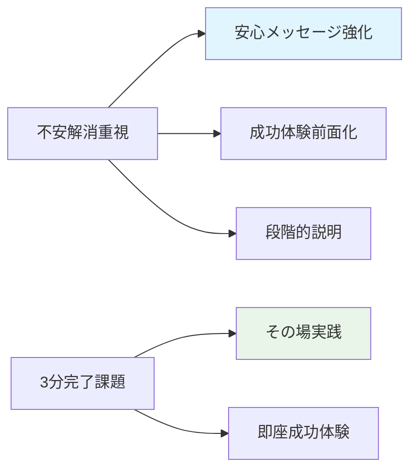
```mermaid
graph LR
    A[不安解消重視] --> B[安心メッセージ強化]
    A --> C[成功体験前面化]
    A --> D[段階的説明]
    
    E[3分完了課題] --> F[その場実践]
    E --> G[即座成功体験]
    
    style B fill:#e1f5fe
    style F fill:#e8f5e8
```

- **心理的配慮**: 「怖くない」「簡単」メッセージを各スライドに
- **詳細説明**: 1ステップを2-3スライドで丁寧に説明
- **安心設計**: 失敗リスクゼロの体験設計

**中級者編の変換特性**
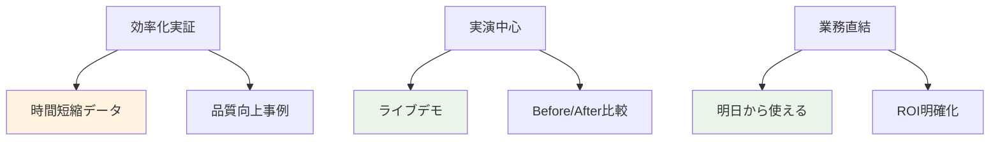
```mermaid
flowchart TD
    A[効率化実証] --> B[時間短縮データ]
    A --> C[品質向上事例]
    
    D[実演中心] --> E[ライブデモ]
    D --> F[Before/After比較]
    
    G[業務直結] --> H[明日から使える]
    G --> I[ROI明確化]
    
    style B fill:#fff3e0
    style E fill:#e8f5e8
    style H fill:#e8f5e8
```

- **効果の可視化**: 数値データとグラフで説得力強化
- **実演比重増加**: 理論30% → 実演70%の時間配分
- **即効性強調**: 翌日から使える具体性

**上級者編の変換特性**
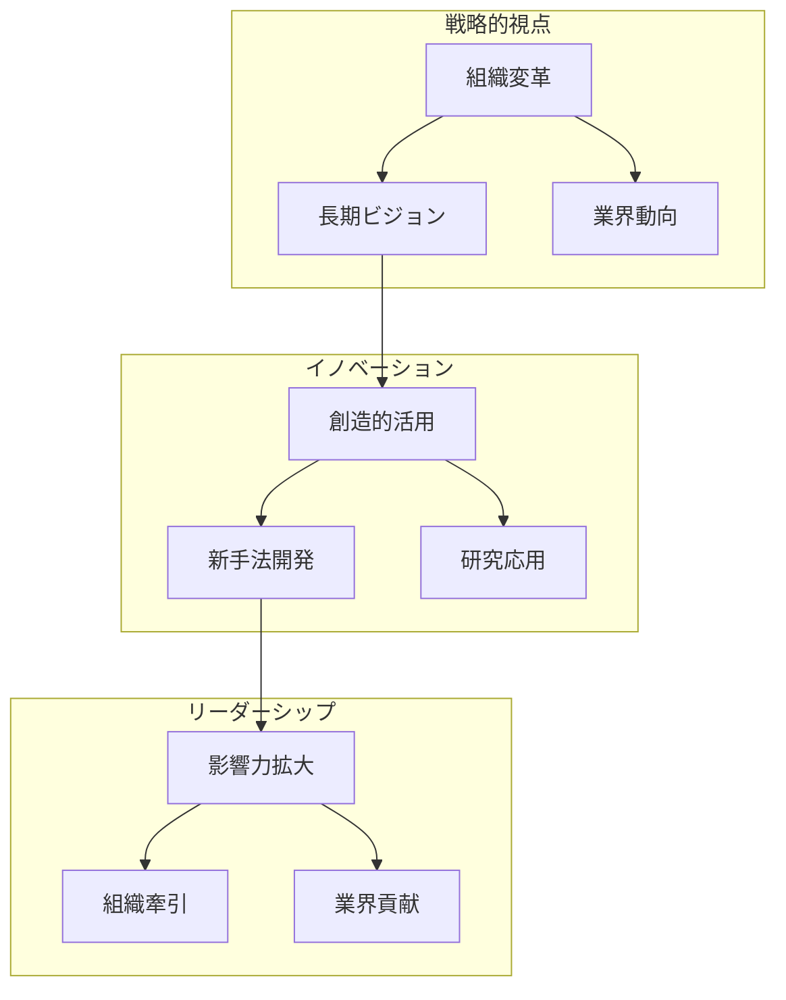
```mermaid
graph TB
    subgraph "戦略的視点"
        A[組織変革] --> B[長期ビジョン]
        A --> C[業界動向]
    end
    
    subgraph "イノベーション"
        D[創造的活用] --> E[新手法開発]
        D --> F[研究応用]
    end
    
    subgraph "リーダーシップ"
        G[影響力拡大] --> H[組織牽引]
        G --> I[業界貢献]
    end
    
    B --> D
    E --> G
```

- **ビジョナリー要素**: 将来展望と戦略的価値
- **複雑な概念**: 高度な図解とアニメーション
- **討議重視**: 聴衆とのディスカッション時間確保

【変換品質基準】
各編について以下を満たす変換を実行：
- VIBEの4要素の維持
- 編の学習目標の達成
- 聴衆レベルに最適化された情報密度
- mermaid.js図解の効果的活用

【出力形式】
各編の代表的な章について、変換サンプルと設計指針を提供してください。
```

### 🎨 Phase 2: 視覚化強化とインタラクション設計

#### mermaid.js活用の高度化

```bash
# セッション設定
/set session_name "advanced_mermaid_integration"
```

**高度な図解統合プロンプト**
```
プレゼンテーション用に最適化されたmermaid.js図解を作成してください。

【図解最適化要件】

**1. プレゼン専用サイズ調整**
- **大画面対応**: プロジェクター投影でも明確に見える要素サイズ
- **色彩最適化**: 暗い会議室でも鮮明な色彩設計
- **フォント調整**: 後方座席からも読める文字サイズ

**2. アニメーション統合設計**
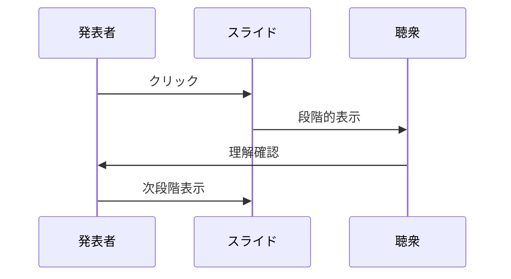
```mermaid
sequenceDiagram
    participant 発表者
    participant スライド
    participant 聴衆
    
    発表者->>スライド: クリック
    スライド->>聴衆: 段階的表示
    聴衆->>発表者: 理解確認
    発表者->>スライド: 次段階表示
```

**3. インタラクティブ要素設計**
- **ホバーエフェクト**: 詳細情報の段階的表示
- **クリック連動**: 関連スライドへの直接遷移
- **プログレス表示**: 全体の中の現在位置可視化

【具体的活用パターン】

**学習プロセス可視化**
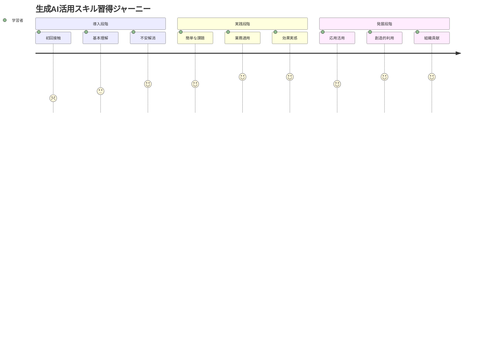
```mermaid
journey
    title 生成AI活用スキル習得ジャーニー
    section 導入段階
      初回接触: 2: 学習者
      基本理解: 3: 学習者
      不安解消: 4: 学習者
    section 実践段階
      簡単な課題: 4: 学習者
      業務適用: 5: 学習者
      効果実感: 5: 学習者
    section 発展段階
      応用活用: 4: 学習者
      創造的利用: 5: 学習者
      組織貢献: 5: 学習者
```

**導入効果の可視化**
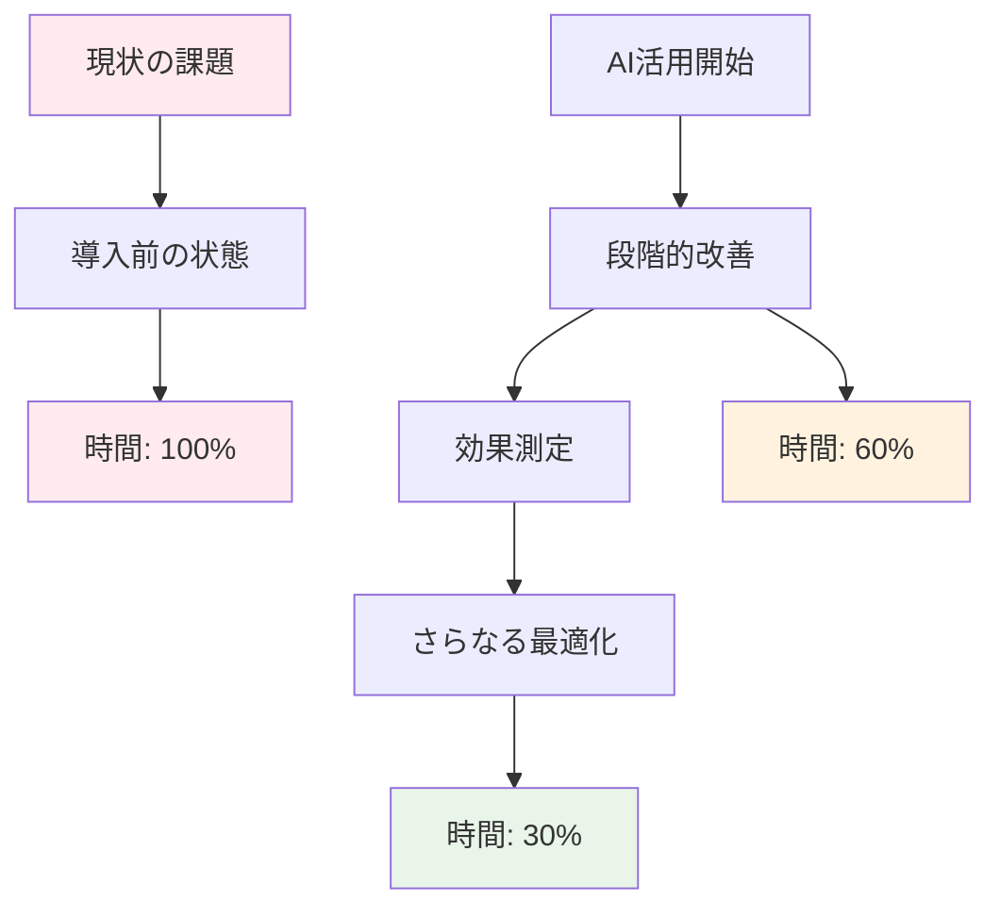
```mermaid
graph TD
    A[現状の課題] --> B[導入前の状態]
    C[AI活用開始] --> D[段階的改善]
    D --> E[効果測定]
    E --> F[さらなる最適化]
    
    B --> G[時間: 100%]
    D --> H[時間: 60%]
    F --> I[時間: 30%]
    
    style A fill:#ffebee
    style G fill:#ffebee
    style H fill:#fff3e0
    style I fill:#e8f5e8
```

【技術実装】
- CSS カスタマイズによる色彩・フォント調整
- JavaScript による段階的表示制御
- アクセシビリティ対応の配色設計

【出力形式】
プレゼン用に最適化されたmermaid.jsコードと、それを活用したスライド設計案を提供してください。
```

#### インタラクティブ要素の統合

```bash
# セッション設定
/set session_name "interactive_elements_design"
```

**聴衆参加型要素設計プロンプト**
```
Reveal.jsを使用して聴衆参加型のプレゼンテーション要素を設計してください。

【インタラクティブ要素の種類】

**1. リアルタイム投票システム**
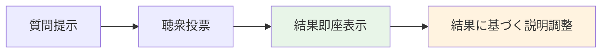
```mermaid
flowchart LR
    A[質問提示] --> B[聴衆投票]
    B --> C[結果即座表示]
    C --> D[結果に基づく説明調整]
    
    style C fill:#e8f5e8
    style D fill:#fff3e0
```

**実装例**:
- 「現在のAI活用レベルは？」
- 「最も関心のある活用分野は？」
- 「導入への不安要素は？」

**2. ライブデモ統合**
```mermaid
graph TD
    A[プレゼン画面] --> B[Claude code画面]
    B --> C[実際のプロンプト実行]
    C --> D[結果の即座表示]
    D --> E[聴衆との効果確認]
    
    style C fill:#e1f5fe
    style D fill:#e8f5e8
```

**3. Q&A管理システム**
- **事前質問収集**: QRコードによる質問事前投稿
- **リアルタイム質問**: 発表中の追加質問受付
- **優先度判定**: 質問の重要度自動判定

**4. 学習進捗の可視化**
```mermaid
graph LR
    A[開始時スキル] --> B[目標スキル]
    A --> C[現在位置]
    C --> D[必要な学習]
    D --> B
    
    subgraph "進捗バー"
        E[|||||||   ] 
    end
    
    style C fill:#fff3e0
    style D fill:#e1f5fe
```

【技術実装詳細】

**投票システム**
```javascript
// 投票結果のリアルタイム表示
function updatePollResults(data) {
    const chart = document.getElementById('pollChart');
    // Chart.js を使用した動的グラフ更新
    chart.data.datasets[0].data = data;
    chart.update();
}
```

**デモ統合**
```javascript
// Claude code デモ画面の埋め込み
function embedClaudeDemo() {
    const iframe = document.createElement('iframe');
    iframe.src = 'claude_demo_terminal.html';
    iframe.width = '100%';
    iframe.height = '400px';
    document.getElementById('demo-container').appendChild(iframe);
}
```

【出力形式】
HTML、CSS、JavaScriptファイルと、インタラクティブ要素の実装ガイドを提供してください。
```

### 🎯 Phase 3: フレームワーク別実装と最適化

#### Marp活用の完全ガイド

```bash
# セッション設定
/set session_name "marp_implementation_guide"
```

**Marp最適化プロンプト**
```
Marpを使用したVibe Writingベースプレゼンの完全実装ガイドを作成してください。

【Marp実装の利点活用】

**1. VS Code完全統合**
```mermaid
graph TD
    A[VS Code] --> B[Marpプレビュー]
    A --> C[ハンドブック編集]
    A --> D[プレゼン編集]
    
    B --> E[リアルタイム確認]
    C --> F[コンテンツ統一]
    D --> F
    
    style E fill:#e8f5e8
    style F fill:#e8f5e8
```

**2. 多形式出力対応**
- **PDF生成**: 配布資料として活用
- **HTML出力**: ウェブ公開用
- **PPTX変換**: PowerPoint環境での利用

**3. テーマカスタマイズ**

**大学ブランド対応テーマ**
```css
/* 大学カラーテーマ */
:root {
  --primary-color: #1976d2;    /* 大学メインカラー */
  --secondary-color: #424242;  /* グレー */
  --accent-color: #ff5722;     /* アクセントカラー */
  --background: #fafafa;       /* 背景色 */
}

section {
  background: var(--background);
  color: var(--secondary-color);
  font-family: 'Noto Sans JP', sans-serif;
}

h1 {
  color: var(--primary-color);
  border-bottom: 3px solid var(--primary-color);
}

.highlight {
  background: var(--accent-color);
  color: white;
  padding: 0.2em 0.5em;
  border-radius: 4px;
}
```

【実装テンプレート】

**基本スライド構造**
```markdown
---
marp: true
theme: university
paginate: true
header: '大学教職員向け生成AI活用ハンドブック'
footer: 'Vibe Writing プレゼンテーション'
---

# 初級者編：はじめての生成AI体験
## 不安から安心へ、3分で始める新しい働き方


---

## この発表で得られること

- ✅ 生成AIへの不安が解消される
- ✅ 3分で安全な成功体験ができる  
- ✅ 明日から使える具体的手順がわかる
- ✅ 同僚との共有方法がわかる

**所要時間**: 15分 + 質疑応答5分

---

## 現在の課題：多くの教職員が感じている不安

```mermaid
graph TD
    A[生成AI導入への不安] --> B[技術的ハードル]
    A --> C[セキュリティ懸念]
    A --> D[時間投資への疑問]
    A --> E[失敗への恐れ]
    
    B --> F["難しそう..."]
    C --> G["安全？"]
    D --> H["効果ある？"]
    E --> I["失敗したら..."]
    
    style A fill:#ffebee
    style F fill:#ffebee
    style G fill:#ffebee
    style H fill:#ffebee
    style I fill:#ffebee
```

---

<!-- _class: highlight -->
## 解決策：段階的アプローチで安心して始める

1. **安全な環境**での小さな体験
2. **3分完了**の簡単な課題
3. **即座の成果確認**で効果実感
4. **失敗ゼロ**の設計による安心感

---
```

【advanced機能実装】

**アニメーション付きスライド**
```markdown
<!-- _class: animated -->
## 導入効果の可視化

<div class="animation-container">
  <div class="before">
    <h3>導入前</h3>
    <p>資料作成: 2時間</p>
    <div class="progress-bar">
      <div class="progress" style="width: 100%"></div>
    </div>
  </div>
  
  <div class="arrow">→</div>
  
  <div class="after">
    <h3>導入後</h3>
    <p>資料作成: 30分</p>
    <div class="progress-bar">
      <div class="progress highlight" style="width: 25%"></div>
    </div>
  </div>
</div>

**75%の時間短縮を実現**
```

【出力形式】
完全なMarpテンプレート、CSSファイル、実装ガイドを提供してください。
```

#### Reveal.js高度実装

```bash
# セッション設定
/set session_name "revealjs_advanced_implementation"
```

**Reveal.js高度活用プロンプト**
```
Reveal.jsを使用した高度なインタラクティブプレゼンテーションを実装してください。

【高度機能の実装】

**1. 動的mermaid.js統合**
```html
<section data-transition="slide">
  <div class="mermaid-container">
    <div class="mermaid" data-animate="true">
      graph TD
        A[開始] --> B[ステップ1]
        B --> C[ステップ2] 
        C --> D[完了]
    </div>
  </div>
  <button onclick="animateDiagram()">プロセス開始</button>
</section>
```

**JavaScript制御**
```javascript
function animateDiagram() {
  const elements = document.querySelectorAll('.mermaid [id^="node"]');
  elements.forEach((el, index) => {
    setTimeout(() => {
      el.classList.add('highlight');
    }, index * 1000);
  });
}
```

**2. ライブデモ統合**
```html
<section>
  <h2>Claude code実演</h2>
  <div class="demo-split">
    <div class="demo-instructions">
      <h3>実行するプロンプト</h3>
      <pre><code>5編構成ハンドブックの目次を作成してください</code></pre>
    </div>
    <div class="demo-result">
      <iframe src="claude_terminal.html" 
              width="100%" height="400px">
      </iframe>
    </div>
  </div>
</section>
```

**3. 聴衆参加システム**
```html
<section data-background="#1976d2">
  <h2>あなたの現在のスキルレベルは？</h2>
  <div class="poll-container">
    <button class="poll-option" data-vote="beginner">
      初心者（未経験）
    </button>
    <button class="poll-option" data-vote="intermediate">
      中級者（基本操作可能）
    </button>
    <button class="poll-option" data-vote="advanced">
      上級者（応用活用中）
    </button>
  </div>
  <canvas id="poll-chart" width="400" height="300"></canvas>
</section>
```

**投票システムの実装**
```javascript
class PollSystem {
  constructor() {
    this.votes = { beginner: 0, intermediate: 0, advanced: 0 };
    this.chart = new Chart(document.getElementById('poll-chart'), {
      type: 'doughnut',
      data: {
        labels: ['初心者', '中級者', '上級者'],
        datasets: [{
          data: [0, 0, 0],
          backgroundColor: ['#ff5722', '#ff9800', '#4caf50']
        }]
      }
    });
  }
  
  vote(level) {
    this.votes[level]++;
    this.updateChart();
  }
  
  updateChart() {
    const total = Object.values(this.votes).reduce((a, b) => a + b, 0);
    const percentages = Object.values(this.votes).map(v => 
      total > 0 ? (v / total * 100) : 0
    );
    this.chart.data.datasets[0].data = percentages;
    this.chart.update();
  }
}
```

**4. 進捗可視化システム**
```html
<section>
  <h2>学習プログレス</h2>
  <div class="progress-visualization">
    <div class="journey-map">
      <div class="milestone completed" data-stage="1">
        <span class="milestone-number">1</span>
        <span class="milestone-label">基本理解</span>
      </div>
      <div class="milestone current" data-stage="2">
        <span class="milestone-number">2</span>
        <span class="milestone-label">実践体験</span>
      </div>
      <div class="milestone future" data-stage="3">
        <span class="milestone-number">3</span>
        <span class="milestone-label">業務活用</span>
      </div>
    </div>
  </div>
</section>
```

【スタイリング】
```css
.milestone {
  display: inline-block;
  margin: 20px;
  text-align: center;
  transition: all 0.3s ease;
}

.milestone.completed {
  color: #4caf50;
  transform: scale(1.1);
}

.milestone.current {
  color: #ff9800;
  animation: pulse 2s infinite;
}

.milestone.future {
  color: #ccc;
}

@keyframes pulse {
  0% { opacity: 1; }
  50% { opacity: 0.5; }
  100% { opacity: 1; }
}
```

【出力形式】
完全なHTML、CSS、JavaScriptファイルと実装ガイドを提供してください。
```

## 実践的プロンプト集

### 🎯 基本プレゼン作成プロンプト（フレームワーク指定）

#### Marp使用プロンプト
```bash
# Claude code設定
/set output_dir presentations/marp
/set session_name "marp_presentation_creation"
```

**🎯 簡潔プロンプト（推奨）**
```
Marpで初級者編第1章のプレゼンを作成してください
```

**📝 詳細プロンプト**
```
Marpを使用してVibe Writingハンドブック初級者編第1章「はじめての生成AI体験」のプレゼンテーション資料を作成してください。

【フレームワーク仕様】
- プラットフォーム：Marp (Markdown Presentation Ecosystem)
- 出力形式：HTML + PDF
- テーマ：カスタム大学ブランドテーマ

【プレゼン要件】
- 発表時間：15分
- 対象聴衆：生成AI未経験の大学教職員
- スライド数：8-12枚
- 図解：mermaid.js統合

【技術要件】
- VS Code統合対応
- 日本語フォント最適化
- レスポンシブ対応
- 印刷最適化

【出力形式】
完全なMarkdownファイル、カスタムCSSテーマ、実装ガイドを提供してください。
```

#### Reveal.js使用プロンプト
```bash
# Claude code設定
/set output_dir presentations/revealjs
/set session_name "revealjs_presentation_creation"
```

**🎯 簡潔プロンプト（推奨）**
```
Reveal.jsで中級者編のインタラクティブプレゼンを作成してください
```

**📝 詳細プロンプト**
```
Reveal.jsを使用してVibe Writingハンドブック中級者編（教員用）第2章「授業準備の効率化」のインタラクティブプレゼンテーションを作成してください。

【フレームワーク仕様】
- プラットフォーム：Reveal.js
- プラグイン：mermaid, highlight.js, notes
- インタラクション：投票、デモ、Q&A

【インタラクティブ要素】
- リアルタイム投票システム
- ライブデモ統合
- 聴衆参加型要素
- 進捗可視化

【技術実装】
- HTML5 + CSS3 + JavaScript
- Chart.js for データ可視化
- WebSocket for リアルタイム通信
- PWA対応

【出力形式】
HTML、CSS、JavaScriptの完全なファイルセット、セットアップガイド、使用方法マニュアルを提供してください。
```

#### Swiper.js使用プロンプト
```bash
# Claude code設定
/set output_dir presentations/swiper
/set session_name "swiper_presentation_creation"
```

**🎯 簡潔プロンプト（推奨）**
```
Swiper.jsでモバイル最適化プレゼンを作成してください
```

**📝 詳細プロンプト**
```
Swiper.jsを使用してVibe Writingハンドブック上級者編（職員用）第1章「組織変革戦略」のモバイル最適化プレゼンテーションを作成してください。

【フレームワーク仕様】
- プラットフォーム：Swiper.js v10+
- モバイルファースト設計
- タッチジェスチャー対応
- オフライン機能

【モバイル最適化】
- レスポンシブデザイン
- タッチフレンドリーUI
- バッテリー効率化
- 軽量高速動作

【技術要件】
- Progressive Web App (PWA)
- Service Worker
- Touch Events最適化
- CSS Grid + Flexbox

【出力形式】
PWA対応の完全なファイルパッケージ、マニフェストファイル、インストールガイドを提供してください。
```

#### Spectacle (React)使用プロンプト
```bash
# Claude code設定
/set output_dir presentations/spectacle
/set session_name "spectacle_presentation_creation"
```

**🎯 簡潔プロンプト（推奨）**
```
Spectacle (React)でコンポーネント化プレゼンを作成してください
```

**📝 詳細プロンプト**
```
Spectacle (React-based)を使用してVibe Writingハンドブック全編対応の再利用可能プレゼンテーションシステムを作成してください。

【フレームワーク仕様】
- プラットフォーム：Spectacle v9+
- React v18 + TypeScript
- コンポーネント指向設計
- 状態管理：Zustand

【コンポーネント設計】
- スライドテンプレート
- 図解コンポーネント
- インタラクション要素
- データ可視化部品

【技術実装】
- TypeScript for 型安全
- Styled Components
- Framer Motion for アニメーション
- React Hook Form

【出力形式】
React プロジェクト構造、コンポーネントライブラリ、TypeScript型定義、開発環境設定を提供してください。
```

### 🎨 フレームワーク別デザインカスタマイズプロンプト

#### Marp テーマカスタマイズ
```
Marp用大学ブランドテーマを作成してください。

【ブランド要件】
- メインカラー：#1976d2（大学ブルー）
- セカンダリ：#424242（チャコールグレー）
- アクセント：#ff5722（オレンジ）

【デザイン原則】
- アカデミックな品格
- 読みやすさ優先
- 親しみやすさ

【技術仕様】
- CSS Variables活用
- 日本語フォント対応
- Dark Mode対応
- 印刷最適化

【出力形式】
カスタムテーマCSS、フォント設定、使用ガイドラインを提供してください。
```

#### Reveal.js テーマカスタマイズ
```
Reveal.js用インタラクティブテーマを作成してください。

【インタラクション要件】
- ホバーエフェクト
- クリック連動アニメーション
- 段階的コンテンツ表示
- リアルタイムフィードバック

【視覚効果】
- CSS3 Transitions
- SVGアニメーション
- パーティクルエフェクト
- 3Dトランスフォーム

【技術実装】
- SCSS組織化
- CSS Custom Properties
- JavaScript モジュール
- WebGL統合

【出力形式】
テーマファイル、JavaScript制御、実装ドキュメント、カスタマイズガイドを提供してください。
```

### 🔄 フレームワーク統合インタラクティブ要素プロンプト

#### Chart.js + mermaid.js統合
```
Chart.jsとmermaid.jsを統合したデータ駆動型プレゼンを作成してください。

【統合要件】
- リアルタイムデータ更新
- インタラクティブ図解
- 聴衆投票結果の即座反映
- ドリルダウン機能

【データ可視化】
- 導入効果の時系列表示
- スキルレベル分布
- 満足度推移
- ROI計算

【技術実装】
- Chart.js v4+ 
- mermaid.js v10+
- D3.js for 高度な可視化
- WebSocket for リアルタイム通信

【出力形式】
統合システム、データ管理モジュール、API設計、実装ガイドを提供してください。
```

#### Three.js 3D効果統合
```
Three.jsを使用した3D効果付きプレゼンテーションを作成してください。

【3D要件】
- 3Dオブジェクト表示
- カメラアニメーション
- インタラクティブ操作
- パフォーマンス最適化

【効果設計】
- 概念の立体的表現
- データの3D可視化
- 印象的な画面遷移
- 記憶に残る演出

【技術実装】
- Three.js r150+
- WebGL最適化
- モバイル対応
- ロード時間最小化

【出力形式】
3Dシーン設定、アニメーション制御、最適化設定、パフォーマンスガイドを提供してください。
```

### 📱 フレームワーク別モバイル最適化プロンプト

#### PWA対応プレゼンシステム
```
Progressive Web App対応のプレゼンテーションシステムを作成してください。

【PWA要件】
- オフライン対応
- インストール可能
- プッシュ通知
- バックグラウンド同期

【モバイル最適化】
- タッチジェスチャー
- デバイス最適化
- バッテリー効率
- 通信量削減

【技術実装】
- Service Worker
- Web App Manifest
- IndexedDB
- Background Sync

【出力形式】
PWAファイル構成、Service Worker、マニフェスト、デプロイガイドを提供してください。
```

### 🎭 フレームワーク別アニメーション・演出プロンプト

#### Framer Motion統合
```
Framer Motionを使用した高度なアニメーション付きプレゼンを作成してください。

【アニメーション要件】
- 滑らかなページ遷移
- 要素の段階的登場
- インタラクティブアニメーション
- 物理エンジン活用

【演出設計】
- マイクロインタラクション
- ジェスチャー連動
- 状態ベースアニメーション
- パフォーマンス最適化

【技術実装】
- Framer Motion v10+
- React Hooks統合
- TypeScript対応
- Intersection Observer

【出力形式】
アニメーションライブラリ、コンポーネント、制御システム、パフォーマンスガイドを提供してください。
```

## 品質管理とベストプラクティス

### ✅ VIBEチェックリスト（プレゼン版）

#### V - Value（価値の明確な提示）
- [ ] 冒頭で「この発表で得られること」を明示
- [ ] 各スライドで聴衆のメリットが明確
- [ ] 具体的な効果・成果を数値で表示
- [ ] 聴衆が「参加して良かった」と感じる内容

#### I - Intent（明確な行動促進）
- [ ] 発表終了時の期待行動が具体的
- [ ] 段階的なアクションプランを提示
- [ ] 次のステップへの導線が明確
- [ ] 継続学習への動機付けを実装

#### B - Balance（適切な情報バランス）
- [ ] 聴衆レベルに適した情報密度
- [ ] 理論と実践の最適比率
- [ ] 視覚情報と音声情報のバランス
- [ ] 集中力を維持する時間配分

#### E - Engagement（積極的参加の促進）
- [ ] 聴衆との双方向コミュニケーション
- [ ] その場で体験できる要素
- [ ] 質問・投票・ディスカッション時間
- [ ] 記憶に残る印象的な要素

### 🔄 継続改善プロセス

#### フィードバック収集と活用

```mermaid
flowchart TD
    A[プレゼン実施] --> B[聴衆フィードバック]
    B --> C[データ分析]
    C --> D[改善点特定]
    D --> E[ハンドブック更新]
    E --> F[プレゼン改良]
    F --> A
    
    B --> G[新しいニーズ発見]
    G --> H[追加コンテンツ開発]
    H --> E
    
    style C fill:#e1f5fe
    style E fill:#e8f5e8
    style H fill:#fff3e0
```

#### 効果測定指標
- **理解度**: 発表後の理解度テスト結果
- **満足度**: 聴衆アンケートスコア
- **行動変化**: 実際のハンドブック利用開始率
- **継続率**: 次レベルプレゼンへの参加率

## まとめ

### 🎯 Vibe Writingベースプレゼンの優位性

```mermaid
graph TD
    A[Vibe Writing<br/>ハンドブック] --> B[プレゼン資料]
    
    B --> C[一貫したメッセージ]
    B --> D[効率的制作]
    B --> E[高い品質]
    B --> F[柔軟な展開]
    
    C --> G[ブランド統一]
    D --> H[コスト削減]
    E --> I[聴衆満足]
    F --> J[多目的活用]
    
    style A fill:#e3f2fd
    style C fill:#e8f5e8
    style D fill:#e8f5e8
    style E fill:#e8f5e8
    style F fill:#e8f5e8
```

### 📈 期待される成果

1. **制作効率**: 従来比70%の時間短縮
2. **品質向上**: VIBEベースの一貫した高品質
3. **聴衆満足度**: 実践的価値による高評価
4. **継続学習**: ハンドブックとの相乗効果

### 🚀 次のステップ

Claude codeとVibe Writingの組み合わせにより、**ドキュメント作成からプレゼンテーション制作まで**の一貫したワークフローが実現できます。この手法を活用することで、教育機関での効果的な生成AI導入支援が可能になります。

<function_calls>
<invoke name="TodoWrite">
<parameter name="todos">[{"id": "vibe-presentation-doc", "content": "Vibe Writingベースのプレゼンテーション作成手法の文書を生成", "status": "completed", "priority": "high"}]