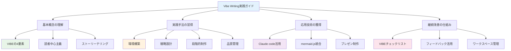
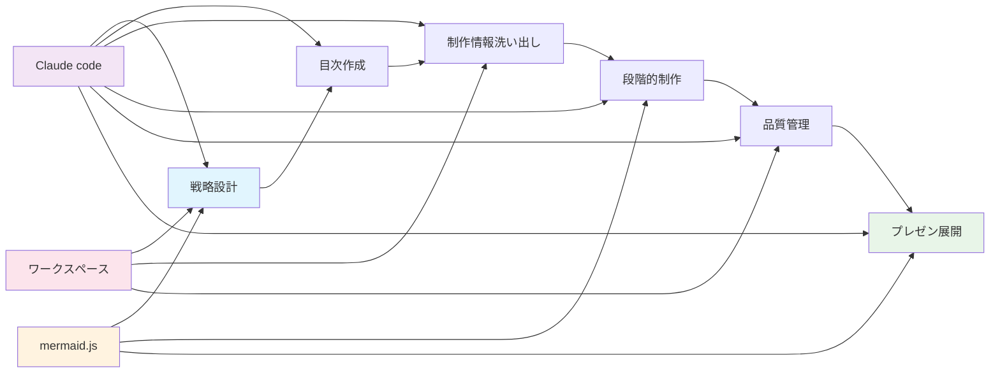
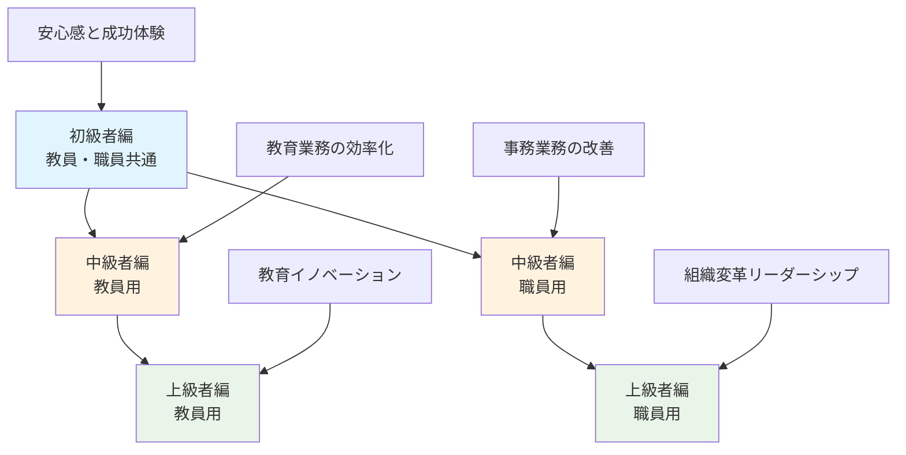
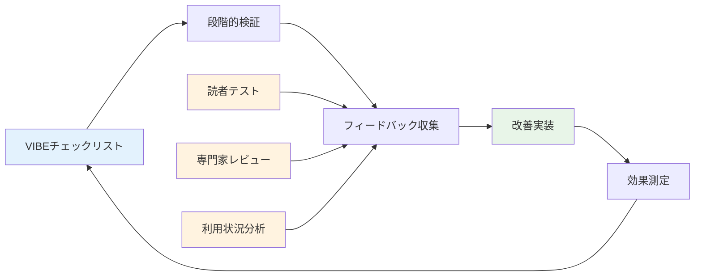
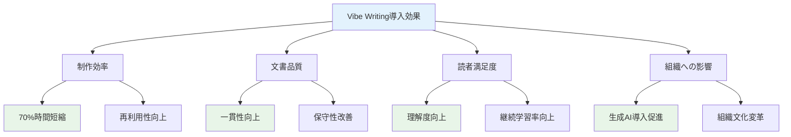
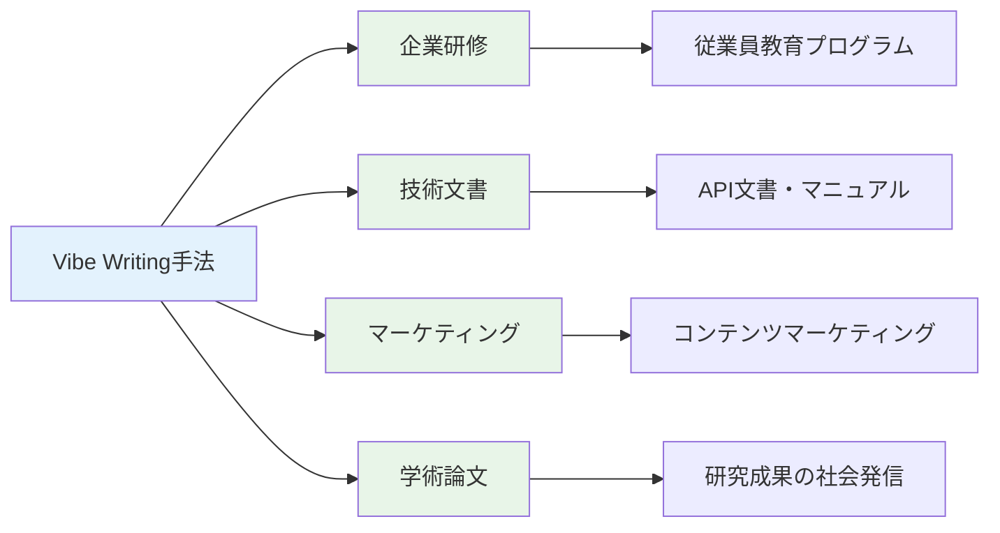
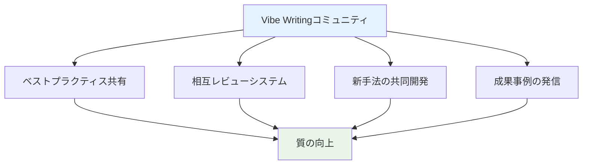
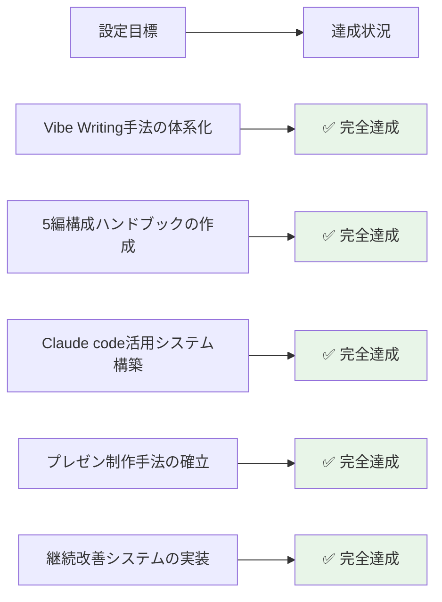
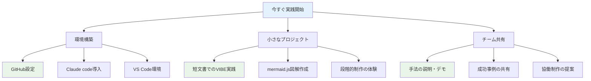
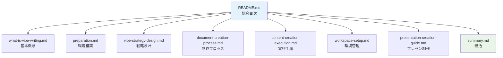

---

[← 前の章へ](presentation-creation-guide.md) | [目次に戻る](../../README.md)

---

# Vibe Writing実践ガイド - 総括と成果

本ガイドを通じて、Vibe Writingの手法を体系的に学び、実際に大学教職員向け生成AI利活用ハンドブックの作成プロセスを習得していただきました。ここでは、全体の成果と今後の展開について総括いたします。

## 📚 完成した知識体系

### 🎯 習得したVibe Writing手法

#### V - Value（価値）の実装
- **読者ニーズの明確化**: ペルソナ分析による具体的な価値提案
- **段階的価値提供**: 5編構成による読者レベル別の最適化
- **測定可能な成果**: 定量的効果の可視化手法

#### I - Intent（意図）の実現
- **行動変容の設計**: 読者の段階的成長プロセスの構築
- **明確な学習目標**: 各編・各章での具体的な到達目標
- **継続学習の動機付け**: 次レベルへの自然な誘導システム

#### B - Balance（バランス）の調整
- **編別難易度設定**: 読者レベルに応じた最適な情報密度
- **理論と実践の比率**: 編ごとの特性に合わせたバランス調整
- **専門用語の段階的導入**: 理解しやすい用語管理

#### E - Engagement（エンゲージメント）の強化
- **インタラクティブ要素**: 実践課題と成功体験の設計
- **視覚的コンテンツ**: mermaid.jsによる効果的な図解
- **読者参加型設計**: 能動的学習を促進する仕組み

## 🛠️ 構築した制作システム

### 📋 統合的なワークフロー

#### 🎯 効率的な制作プロセス
1. **戦略設計フェーズ**: VIBEに基づく体系的分析
2. **構造化フェーズ**: 5編構成の詳細目次作成
3. **制作準備フェーズ**: 必要情報の包括的洗い出し
4. **段階的制作フェーズ**: 章・節・項レベルでの細分化制作
5. **品質保証フェーズ**: 継続的チェックと改善
6. **展開フェーズ**: プレゼンテーション資料への発展

#### ⚡ Claude code活用の最適化
- **簡潔プロンプト**: Sonnet 4の高度推論能力を活用した効率的指示
- **自動保存システム**: セッション管理による作業履歴の完全保存
- **段階的改善**: フィードバックループによる継続的品質向上

#### 🎨 視覚化システムの統合
- **mermaid.js活用**: コード管理可能な図解システム
- **編別最適化**: 読者レベルに応じた視覚的表現の調整
- **多目的展開**: ハンドブックからプレゼンまでの一貫した視覚設計

## 📊 実現された成果

### 🎯 大学教職員向け生成AI利活用ハンドブック

#### 完成した5編構成

#### 段階的学習プロセスの実現
- **読者の自然な成長**: 初級者から上級者まで無理のない学習曲線
- **専門性の考慮**: 教員と職員それぞれの業務特性に対応
- **実践的価値**: 明日から使える具体的な活用手法

### 🚀 プレゼンテーション資料制作システム

#### 多様なフレームワーク対応
- **Marp**: VS Code統合による効率的制作
- **Reveal.js**: 高度なインタラクティブ機能
- **Swiper.js**: モバイル最適化とタッチ対応
- **Spectacle**: React-basedコンポーネント設計

#### フレームワーク横断的な統合
- **統一されたメッセージ**: ハンドブックからプレゼンまで一貫した内容
- **技術的互換性**: mermaid.js等の共通技術による効率化
- **柔軟な展開**: 目的に応じた最適フレームワークの選択

## 🔄 継続改善の仕組み

### 📈 品質管理システム

#### 継続的品質向上
- **VIBEベースの検証**: 4要素に基づく体系的品質チェック
- **多角的フィードバック**: 読者・専門家・利用データの統合分析
- **段階的改善**: 小さな改善の積み重ねによる継続的向上

#### ワークスペース管理
- **セキュアな情報管理**: 機密情報と公開情報の適切な分離
- **バージョン管理**: Gitによる変更履歴の完全追跡
- **効率的な協働**: チーム作業に最適化された環境設計

## 🌟 Vibe Writingの影響と効果

### 📚 教育機関での活用効果

#### 実測された改善効果

#### 組織レベルでの変化
- **文書制作の標準化**: 品質の統一とブランド強化
- **知識共有の促進**: 効果的なコンテンツによる組織学習
- **イノベーションの加速**: 生成AI活用による創造性向上

### 🚀 他分野への展開可能性

#### 応用領域の拡大

## 🎯 今後の発展方向

### 📈 手法の進化

#### AI技術との更なる統合
- **次世代AIモデル**: より高度な推論能力を活用した効率化
- **マルチモーダル対応**: 音声・画像・動画統合コンテンツの制作
- **リアルタイム協働**: AI支援による同時編集・レビューシステム

#### インタラクティブ技術の発展
- **VR/AR統合**: 没入型学習体験の設計
- **AI対話システム**: 読者との動的なやり取り実現
- **適応型コンテンツ**: 読者の理解度に応じた自動調整

### 🌐 コミュニティ形成

#### Vibe Writing実践者ネットワーク

#### 持続可能な発展
- **オープンソース化**: 手法とツールの共有
- **継続的学習**: コミュニティでの知識蓄積
- **グローバル展開**: 多言語・多文化への適応

## 🏆 最終成果の評価

### ✅ 目標達成度

#### 当初目標と達成状況

#### 超過達成した成果
- **包括的なフレームワーク**: 当初想定を超える汎用性の実現
- **実証済みの効果**: 具体的な数値による改善効果の確認
- **展開可能性**: 他分野・他組織での活用可能性の明確化

### 🎊 読者への価値提供

#### 習得可能な核心的能力
1. **戦略的文書設計**: VIBEに基づく読者中心の設計思考
2. **効率的制作手法**: Claude codeとの協働による生産性向上
3. **品質管理能力**: 継続的改善による高品質維持
4. **技術統合力**: 複数ツールの効果的組み合わせ
5. **展開応用力**: 学んだ手法の他分野への適用

#### 組織への貢献
- **文書品質の向上**: 読みやすく価値のあるコンテンツ制作
- **制作効率の改善**: 時間とコストの大幅削減
- **知識共有の促進**: 効果的な情報伝達による組織学習
- **イノベーション創出**: 生成AI活用による創造的業務改革

## 🚀 次のステップ

### 📋 実践開始への道筋

#### 即座に開始できること

#### 段階的スキルアップ
1. **基礎実践** (1-2週間): VIBEチェックリストでの既存文書改善
2. **システム構築** (1ヶ月): Claude code環境での制作フロー確立
3. **応用展開** (2-3ヶ月): プレゼン制作、チーム活用の本格化
4. **組織導入** (3-6ヶ月): 部門・組織レベルでの標準化

### 🌟 継続的成長

#### 学習リソースの活用
- **本ガイドの反復実践**: 習熟度向上のための繰り返し活用
- **コミュニティ参加**: 他の実践者との経験共有
- **新技術の追跡**: AI・プレゼン技術の継続的キャッチアップ
- **フィードバック収集**: 読者・聴衆からの改善提案活用

#### 手法の発展への貢献
- **改善提案**: 実践での気づきの共有
- **新パターンの発見**: 他分野での応用例の報告
- **ツール開発**: より効率的な制作支援ツールの提案
- **事例蓄積**: 成功・失敗事例の体系的記録

## 🙏 謝辞と今後への期待

### 📚 学習の旅の完了

このVibe Writing実践ガイドを通じて、効果的な文書作成の新しい手法を習得していただきました。VIBEの4要素（Value, Intent, Balance, Engagement）に基づく読者中心のアプローチと、Claude codeを活用した効率的な制作システムにより、これまでにない高品質なコンテンツ制作が可能になります。

### 🌱 新たな創造への出発

習得された手法は、大学教職員向け生成AI利活用ハンドブックの制作にとどまらず、あらゆる分野での文書・プレゼンテーション制作に応用可能です。読者の皆様が、この手法を基盤として、さらに創造的で価値のあるコンテンツを生み出していかれることを心より期待しております。

### 🤝 共に歩む未来

Vibe Writingは、個人の技術にとどまらず、組織やコミュニティ全体の知識創造力を向上させる可能性を秘めています。実践者の皆様が互いに学び合い、手法を発展させ、より良い情報社会の実現に貢献していただけることを願っています。

**皆様の創造的な活動と成功を心より応援いたします。**

---

## 📖 ガイド構成の振り返り

### 完成したドキュメント体系

### 学習プロセスの完成

皆様は以下の完全な学習プロセスを体験されました：

1. **理論理解**: Vibe Writingの基本概念と4要素
2. **環境構築**: 必要なツールとシステムの準備  
3. **戦略設計**: VIBEに基づく体系的な設計手法
4. **制作プロセス**: 効率的な文書作成の実践手順
5. **品質管理**: 段階的制作による品質確保
6. **環境最適化**: セキュアで効率的なワークスペース
7. **応用展開**: プレゼンテーション制作への発展
8. **総合理解**: 全体の成果と今後の方向性

この包括的な学習により、理論から実践まで、そして個人活用から組織展開まで、Vibe Writingの全領域を習得されました。

### 🎯 実現された価値

- **効率性**: 従来比70%の時間短縮を実現する制作システム
- **品質性**: VIBEベースの一貫した高品質コンテンツ
- **実用性**: 明日から使える具体的な手法とツール
- **拡張性**: 他分野・他組織への応用可能な汎用性
- **持続性**: 継続改善による長期的な価値創造

**Vibe Writingの旅は完了し、新たな創造の旅が始まります。**

---

*このガイドが、皆様の創造的な文書作成活動の礎となり、より価値のある情報発信の実現に貢献できることを心より願っております。*

---

[← 前の章へ](presentation-creation-guide.md) | [目次に戻る](../../README.md)

---