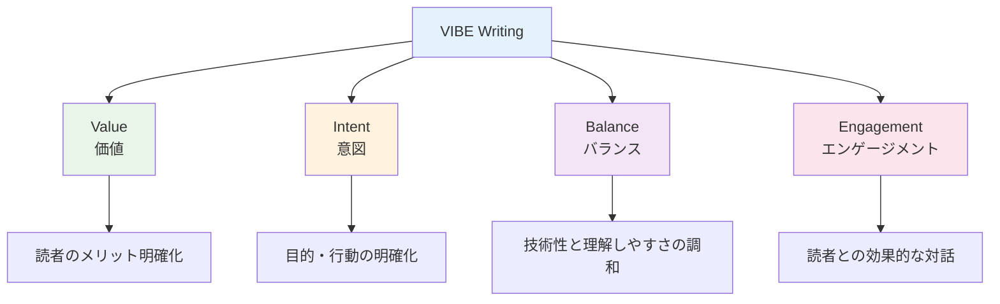
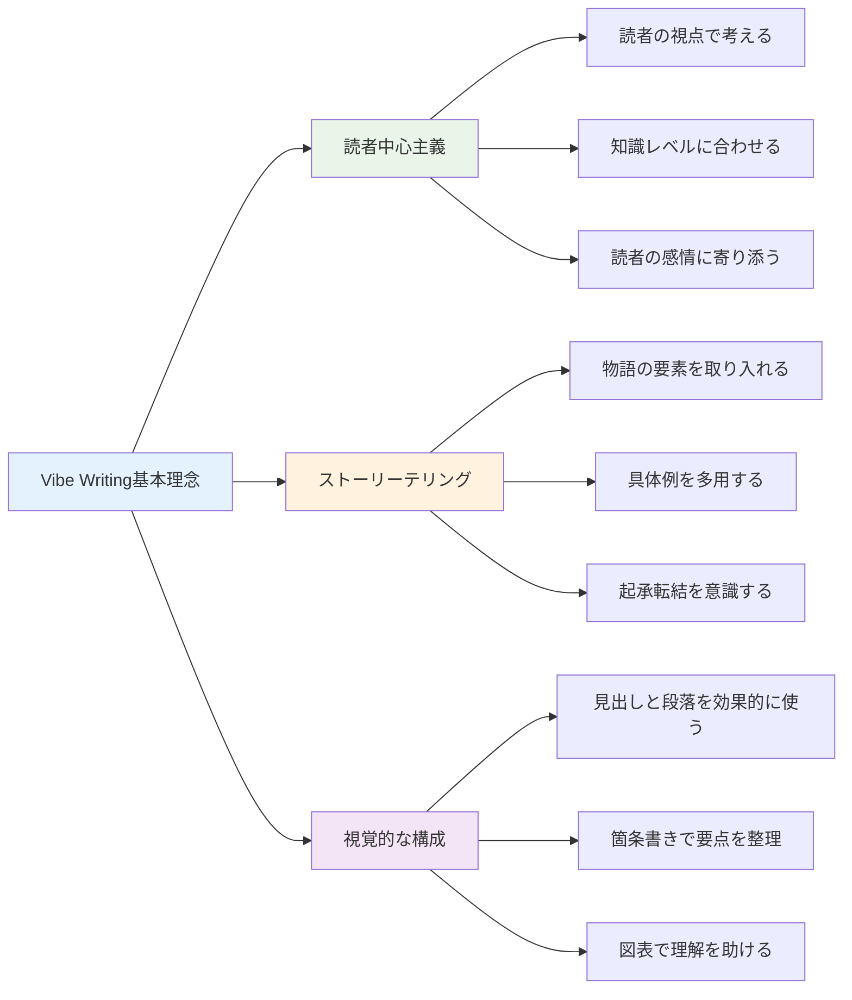
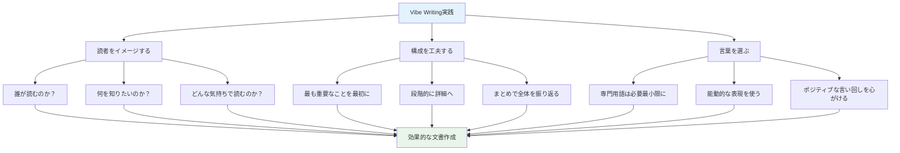
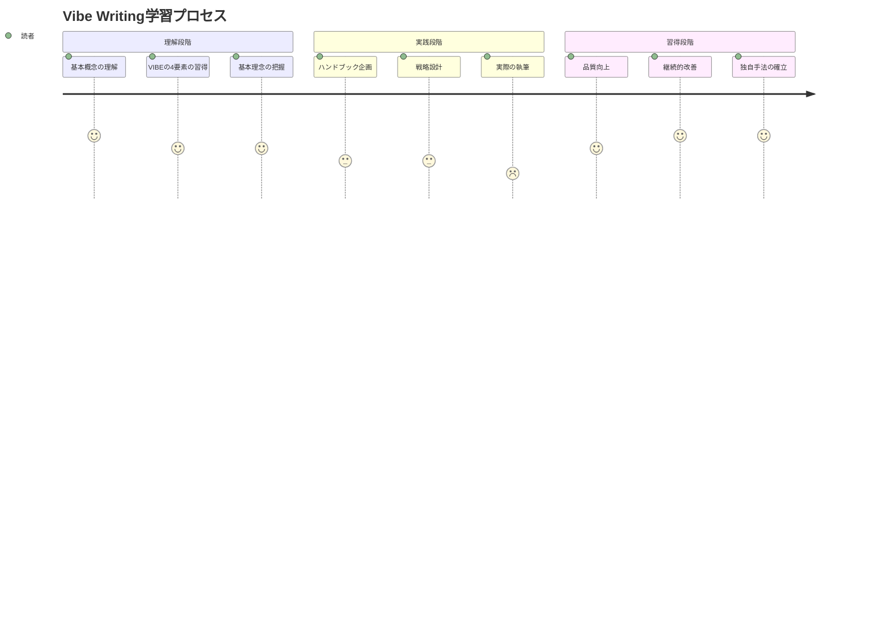

---

[← 目次に戻る](../../README.md) | [次の章へ →](preparation.md)

---

# Vibe Writingとは

## 概要

Vibe Writingは、読者の感情や雰囲気（Vibe）を重視した文書作成手法です。単に情報を伝えるだけでなく、読者が内容を理解し、共感し、行動を起こしやすくすることを目的としています。

## VIBEの4要素

Vibe WritingのVIBEは、以下の4つの要素から構成される頭字語でもあります：

### V - Value（価値）
読者にとっての明確な価値提案を提供します。文書を読むことで読者が得られる具体的なメリットを常に意識します。

### I - Intent（意図）
文書作成者の明確な目的意識を持ちます。何を伝えたいのか、読者にどんな行動を促したいのかを明確にします。

### B - Balance（バランス）
技術性と理解しやすさの最適な調和を図ります。専門性を保ちながら、誰にでも理解できる表現を心がけます。

### E - Engagement（エンゲージメント）
読者との効果的な対話を実現します。一方的な情報提供ではなく、読者が参加したくなる文書を作成します。

## 基本理念

### 1. 読者中心主義
- 読者の視点で考える
- 読者の知識レベルに合わせる
- 読者の感情に寄り添う

### 2. ストーリーテリング
- 物語の要素を取り入れる
- 具体例を多用する
- 起承転結を意識する

### 3. 視覚的な構成
- 見出しと段落を効果的に使う
- 箇条書きで要点を整理
- 図表で理解を助ける

## Vibe Writingの特徴

### 感情への訴求
技術文書であっても、読者の感情に配慮します。難しい内容も、読者が「わかった！」という喜びを感じられるように工夫します。

### リズムとテンポ
文章にリズムを持たせ、読みやすさを追求します。短い文と長い文を組み合わせ、単調にならないよう配慮します。

### 具体性と抽象性のバランス
抽象的な概念を説明する際は、必ず具体例を添えます。逆に、具体例から一般的な原則を導き出すこともあります。

## 実践のポイント

1. **読者をイメージする**
   - 誰が読むのか
   - 何を知りたいのか
   - どんな気持ちで読むのか

2. **構成を工夫する**
   - 最も重要なことを最初に
   - 段階的に詳細へ
   - まとめで全体を振り返る

3. **言葉を選ぶ**
   - 専門用語は必要最小限に
   - 能動的な表現を使う
   - ポジティブな言い回しを心がける

## まとめ

Vibe Writingは、情報伝達と感情への配慮を両立させる文書作成手法です。読者が内容を理解するだけでなく、読んで良かったと感じてもらえる文書を目指します。

本書では、大学の教職員向けの生成AI利活用ハンドブックを実際に作成していく例を元にVibe Writingのやり方について学んでいきます。

## 学習の流れ

---

[← 目次に戻る](../../README.md) | [次の章へ →](preparation.md)

---