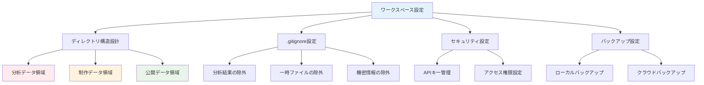
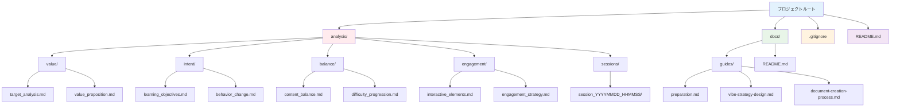
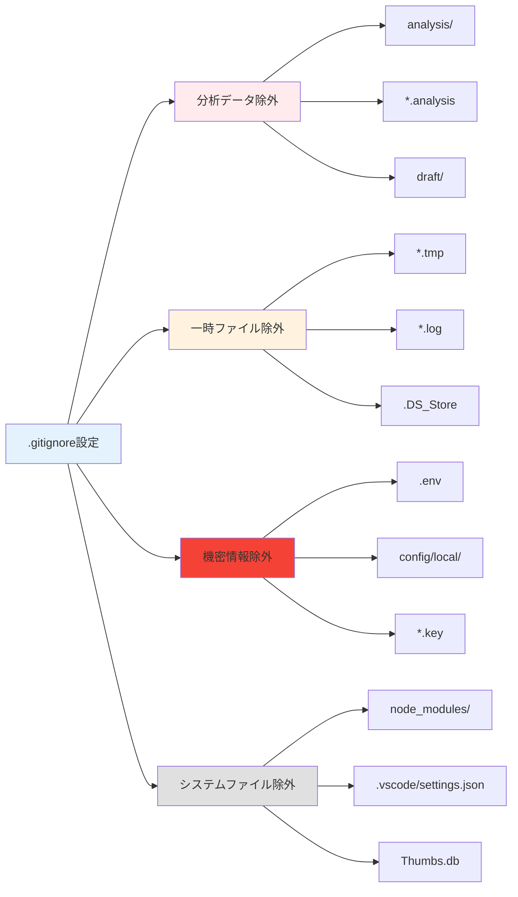
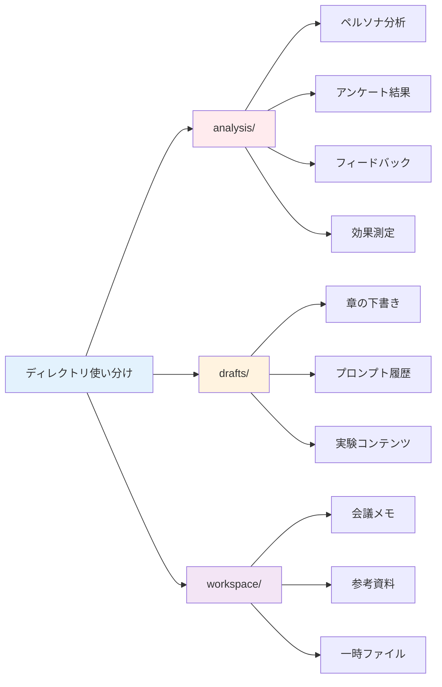
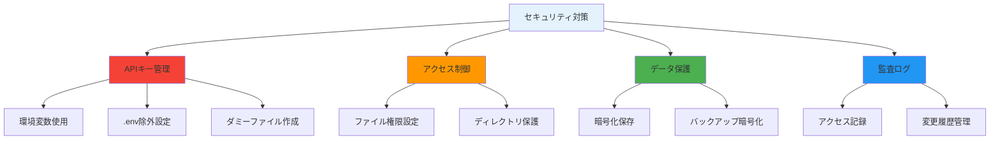
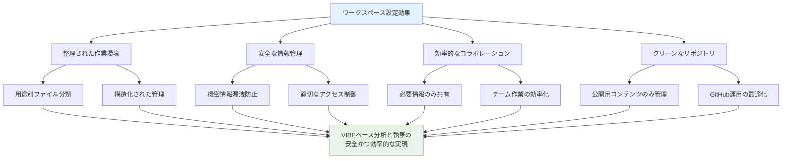

[← 前の章へ](content-creation-execution.md) | [目次に戻る](../../README.md) | [次の章へ →](presentation-creation-guide.md)

# ワークスペースの設定と分析データの管理



VIBEに基づくドキュメント作成では、多くの分析データや下書きが生成されます。これらの作業用ファイルはGitHubにプッシュする必要がないため、適切なディレクトリ構造とGitの設定が重要です。

## ディレクトリ構造の設計



### 推奨ディレクトリ構成

```
project-root/
├── docs/                    # 公開用ドキュメント（GitHubにプッシュ）
│   ├── guides/             # ガイド文書
│   ├── handbook/           # ハンドブック本体
│   └── resources/          # 画像やテンプレート
├── analysis/               # 分析データ（GitHubにプッシュしない）
│   ├── personas/           # ペルソナ分析
│   ├── surveys/            # アンケート結果
│   ├── feedback/           # フィードバックデータ
│   └── metrics/            # 効果測定データ
├── drafts/                 # 下書き（GitHubにプッシュしない）
│   ├── chapters/           # 章ごとの下書き
│   ├── prompts/            # 使用したプロンプト
│   └── experiments/        # 実験的なコンテンツ
├── workspace/              # 作業用ファイル（GitHubにプッシュしない）
│   ├── notes/              # メモや議事録
│   ├── references/         # 参考資料
│   └── temp/               # 一時ファイル
└── .gitignore              # Git除外設定
```

## ディレクトリ作成手順

### WSLまたはターミナルでの作成

```bash
# プロジェクトルートに移動
cd /path/to/your/project

# 分析用ディレクトリの作成
mkdir -p analysis/{personas,surveys,feedback,metrics}

# 下書き用ディレクトリの作成
mkdir -p drafts/{chapters,prompts,experiments}

# 作業用ディレクトリの作成
mkdir -p workspace/{notes,references,temp}

# 各ディレクトリにREADMEを作成
echo "# 分析データ\nこのディレクトリはGitHubにプッシュされません。" > analysis/README.md
echo "# 下書き\nこのディレクトリはGitHubにプッシュされません。" > drafts/README.md
echo "# 作業用ファイル\nこのディレクトリはGitHubにプッシュされません。" > workspace/README.md
```

## .gitignoreの設定



### 基本的な.gitignore設定

```gitignore
# 分析データとドラフト
/analysis/
/drafts/
/workspace/

# 一時ファイル
*.tmp
*.bak
*~
.DS_Store

# 個人設定
.env
.env.local
config.local.json

# エディタ設定
.vscode/
.idea/
*.swp
*.swo

# ログファイル
*.log
logs/

# 生成されたファイル
*.generated.*
output/
build/

# 機密情報
credentials/
secrets/
*.key
*.pem
```

### プロジェクト固有の除外設定

```gitignore
# プロジェクト固有の除外
/analysis/**/*.csv
/analysis/**/*.xlsx
/drafts/**/*.docx
/workspace/temp/**

# 大きなファイル
*.pdf
*.zip
*.tar.gz

# 個人的なメモ
personal-notes/
todo-local.txt
```

## Git設定の確認と適用

### .gitignoreの作成と確認

```bash
# .gitignoreファイルの作成
touch .gitignore

# 上記の内容を.gitignoreに追加
# VS Codeやお好みのエディタで編集

# .gitignoreが正しく機能しているか確認
git status --ignored

# 特定のファイルが無視されているか確認
git check-ignore -v analysis/test.txt
```

### 既に追跡されているファイルの除外

```bash
# もし既に追跡されているファイルを除外する場合
git rm -r --cached analysis/
git rm -r --cached drafts/
git rm -r --cached workspace/

# .gitignoreの変更をコミット
git add .gitignore
git commit -m "Add .gitignore for analysis and draft directories"
```

## ディレクトリの使い分けガイド



### analysis/ - 分析データ

このディレクトリには以下を保存します：

- **personas/**: ペルソナ分析の結果、インタビューメモ
- **surveys/**: アンケートの生データ、集計結果
- **feedback/**: ユーザーフィードバック、レビューコメント
- **metrics/**: 効果測定データ、KPI追跡

#### ファイル命名規則の例
```
analysis/
├── personas/
│   ├── 2024-01-15_teacher_persona_v1.md
│   └── 2024-01-20_staff_persona_final.md
├── surveys/
│   ├── 2024-01-10_initial_survey_raw.csv
│   └── 2024-01-10_initial_survey_analysis.md
```

### drafts/ - 下書き

このディレクトリには以下を保存します：

- **chapters/**: 各章の下書き、複数バージョン
- **prompts/**: 使用したAIプロンプトと結果
- **experiments/**: 試験的なコンテンツ、ボツ案

#### バージョン管理の例
```
drafts/
├── chapters/
│   ├── ch01_introduction_v1.md
│   ├── ch01_introduction_v2.md
│   └── ch01_introduction_v3_review.md
├── prompts/
│   ├── 2024-01-15_persona_creation.txt
│   └── 2024-01-16_content_generation.txt
```

### workspace/ - 作業用ファイル

このディレクトリには以下を保存します：

- **notes/**: 会議メモ、アイデア、TODO
- **references/**: 参考文献、関連資料
- **temp/**: 一時的な作業ファイル

## ベストプラクティス

### 1. 定期的なクリーンアップ

```bash
# 不要な一時ファイルの削除
find workspace/temp -type f -mtime +7 -delete

# 大きなファイルの確認
du -sh analysis/* | sort -hr
```

### 2. バックアップの推奨

GitHubにプッシュしないファイルも重要なので、別途バックアップを取ることを推奨します：

- クラウドストレージ（OneDrive、Google Drive等）
- 外部ハードドライブ
- プライベートGitリポジトリ（別途作成）

### 3. ドキュメント化

各ディレクトリにREADMEを配置し、以下を記載：

```markdown
# analysis/personas/README.md

## このディレクトリの目的
ペルソナ分析の結果を保存します。

## ファイル命名規則
`YYYY-MM-DD_対象者_内容_バージョン.拡張子`

## 注意事項
- 個人情報は匿名化すること
- GitHubにはプッシュされません
```

### 4. チーム共有時の注意

チームで作業する場合の共有方法：

1. **共有が必要なファイル**: 別途共有フォルダを使用
2. **プロンプト共有**: `docs/resources/prompts/`に汎用版を保存
3. **分析結果**: サマリーのみ`docs/`に含める

## セキュリティ上の注意



### 機密情報の取り扱い

以下の情報は絶対にGitHubにプッシュしない：

- APIキー、アクセストークン
- 個人情報（実名、メールアドレス等）
- 組織の内部情報
- ライセンスが必要な資料

### 確認コマンド

```bash
# コミット前の確認
git status
git diff --cached

# 機密情報のスキャン（例：APIキー）
git grep -E "api[_-]?key|token|secret|password" 

# 大きなファイルの確認
find . -type f -size +10M | grep -v "^./.git"
```

## まとめ



適切なディレクトリ構造とGit設定により、以下が実現できます：

1. **整理された作業環境**: 用途別にファイルを分類
2. **安全な情報管理**: 機密情報の漏洩防止
3. **効率的なコラボレーション**: 必要な情報のみ共有
4. **クリーンなリポジトリ**: 公開用コンテンツのみGitHubで管理

この設定により、VIBEに基づく分析と執筆作業を安全かつ効率的に進めることができます。

---

[← 前の章へ](content-creation-execution.md) | [目次に戻る](../../README.md) | [次の章へ →](presentation-creation-guide.md)

---